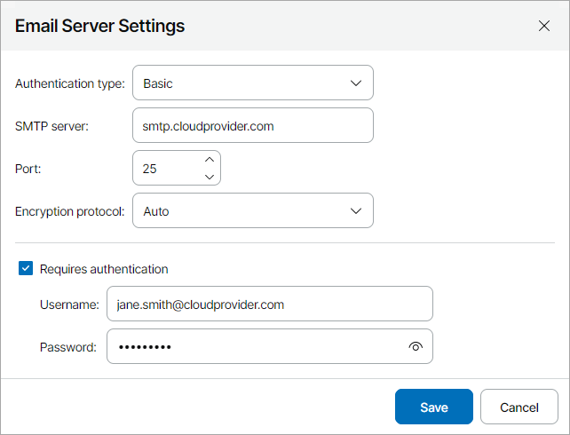
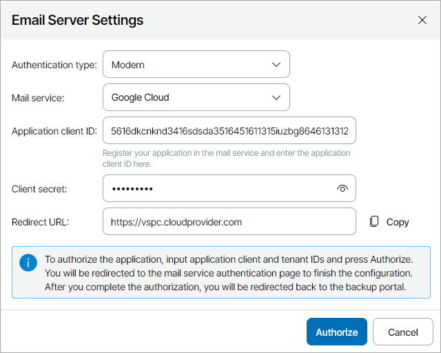
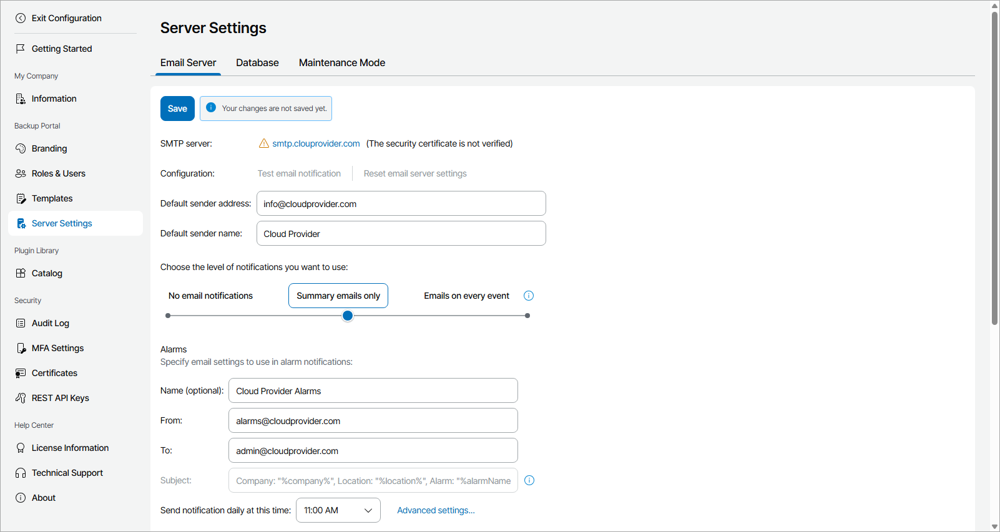

# Configuring Notification Settings

In Veeam Service Provider Console, you can receive notifications from the notification bell or by email.

To check notifications while working in Veeam Service Provider Console portal, click the notification bell in the top right corner of the Veeam Service Provider Console window.

To send out and receive Veeam Service Provider Console notifications by email, you must configure notification settings:

* [SMTP server settings](configure_email_settings.md#smtpServer) or [mail service integration](#mailService)
* [Notification frequency settings](configure_email_settings.md#global)

Required Privileges

To perform this task, a user must have the following role assigned: Portal Administrator.

Configuring SMTP Server Settings

To send out notifications by email, you can configure an SMTP server.

To configure SMTP server settings:

1. Log in to Veeam Service Provider Console.

For details, see [Accessing Veeam Service Provider Console](access_vac.md).

1. At the top right corner of the Veeam Service Provider Console window, click Configuration.
2. In the configuration menu on the left, click Server Settings and navigate to Email Server.
3. Click the SMTP server status link.

The Email Server Settings window will pop out.

1. From the Authentication type list, select Basic.
2. In the SMTP server field, specify an FQDN or IP address of the SMTP server.
3. If required, change the SMTP communication port in the Port field.

By default, Veeam Service Provider Console uses port 25 for communication with the SMTP server.

1. From the Encryption protocol list, select the necessary encryption protocol (Auto, None (not secure), SSL on connect, StartTLS, StartTLS when available).
2. If the SMTP server requires authentication, select the Requires authentication check box and specify authentication credentials in the Username and Password fields.
3. Click Save.

Veeam Service Provider Console will check the TLS certificate of the SMTP server. If the certificate is not trusted, Veeam Service Provider Console displays a warning.

* To view detailed information about the certificate, click View.
* If you trust the server, click Continue. SMTP server status will be changed to The security certificate is not verified.
* If you do not trust the server, click Cancel.

1. To save SMTP server settings, at the top of the page, click Save.

To make sure that SMTP server settings are configured correctly, you can send a test email message:

1. Click the Test email notification link.
2. In the From field of the Email Notification window, specify an email address from which the test email message must be sent.
3. In the To field, specify an email address at which the test email message must be sent.
4. Click Send.
5. In the window with the notification delivery result, click OK.
6. Open your mailbox and make sure that you have received the test email message.

If you want to reset configured mail server settings, click Reset email server settings and in the confirmation window click Yes.

Configuring Mail Service Integration

To send out notifications by email, you can configure Veeam Service Provider Console integration with a 3rd party mail service provider.

Before You Begin

Before you configure Veeam Service Provider Console integration with a mail service provider, do the following:

* Add Veeam Service Provider Console to your mail service and save application identification parameters.
* Add email addresses that you plan to use in Veeam Service Provider Console notification emails to your mail service aliases list.

Configuring Mail Service Integration

To configure mail service integration:

1. Log in to Veeam Service Provider Console.

For details, see [Accessing Veeam Service Provider Console](access_vac.md).

1. At the top right corner of the Veeam Service Provider Console window, click Configuration.
2. In the configuration menu on the left, click Server Settings and navigate to Email Server.
3. Click the SMTP server status link.

The Email Server Settings window will pop out.

1. From the Authentication type list, select Modern.
2. From the Mail service list, select your mail service provider (Google Cloud, Microsoft Azure, Microsoft Azure (US Goverment), Microsoft Azure (China), Microsoft Azure (Germany)).
3. In the Application client ID, Client secret and Tenant ID (for Microsoft Azure authentication) fields, specify Veeam Service Provider Console identification parameters in the mail service.
4. In the Redirect URL field, check the URL address under which Veeam Service Provider Console must be registered in the mail service.

You can copy the specified URL to register Veeam Service Provider Console in the mail service.

1. Click Authorize.

You will be redirected to your mail service provider page. After you complete the authentication, you will be redirected to Veeam Service Provider Console portal and the mail server settings will be saved automatically.

To make sure that the mail server settings are configured correctly, you can send a test email message:

1. Click the Test email notification link.
2. In the From field of the Email Notification window, specify an email address from which the test email message must be sent.
3. In the To field, specify an email address at which the test email message must be sent.
4. Click Send.
5. In the window with the notification delivery result, click OK.
6. Open your mailbox and make sure that you have received the test email message.

If you want to reset configured mail server settings, click Reset email server settings and in the confirmation window click Yes.

Configuring Notification Frequency Settings

You can specify notification frequency settings for the following types of email notifications:

* Alarm notifications

Note that alarms triggered on Veeam ONE servers will not be included in the email notifications.

* Summary notifications for discovery rules
* Billing notifications

You can choose how often you want to receive email notifications:

1. Log in to Veeam Service Provider Console.

For details, see [Accessing Veeam Service Provider Console](access_vac.md).

1. At the top right corner of the Veeam Service Provider Console window, click Configuration.
2. In the configuration menu on the left, click Server Settings and navigate to Email Server.
3. Make sure you have specified SMTP server settings as described in [Configuring SMTP Server Settings](configure_email_settings.md#smtpServer).
4. In the Default sender address field, specify the default address that will be displayed in the From field in the notifications sent by Veeam Service Provider Console.
5. In the Default sender name field, specify the default sender name that will be displayed in the From field in the notifications sent by Veeam Service Provider Console.
6. Use the slider or click the option name to select notification frequency:

* No email notifications

Select this option if you do not want to receive email notifications about triggered alarms and discovery results. Veeam Service Provider Console will use the address specified in your company profile to deliver welcome emails to client companies, subtenant creation emails, invoices and reports that you send manually using product web UI.

Note that subtenant creation emails will be sent only for automatically created subtenants. For details, see [Automatic Creation of Subtenants](create_subtenant_user.md#auto).

* Summary emails only

Select this option if you want to receive daily email notification with information about discovery results for all rules for the past 24 hours and all triggered alarms. Billing and report notifications to companies will be sent automatically after invoices and scheduled reports are generated.

* Emails on every event

Select this option if you want to receive notifications for each triggered alarm, every discovery rule, and customize the subject of email notifications. Billing and report notifications to companies will be sent automatically after invoices and scheduled reports are generated.

1. In the Alarms section, specify settings to use in notifications about alarms:

* [Optional] In the Name field, specify the sender name that will be displayed in the From field in the alarm notifications sent by Veeam Service Provider Console.
* In the From field, specify an email address from which notifications must be sent.

An email address specified in this field will be displayed in alarm notifications.

* In the To field, specify an email address to which notifications must be sent.

An email address specified in this field will be used as the recipient address for alarm notifications.

* [For summary emails only] From the Send notification daily at this time drop-down list, select time of the day when the summary daily notification must be sent.

Veeam Service Provider Console will send a summary daily email notification with information about all alarms triggered for the past 24 hours.

* [For summary emails only] Click Advanced settings and specify alarm statuses for which summary daily notifications must be sent and the way alarms will be grouped in the email (by Time or Severity).
* [For emails on every event] To customize the subject of alarm notifications, in the Subject field, type the text that will be displayed as the subject of alarm notifications.

You can use the following variables: %company%, %location%, %alarmName%, %alarmStatus%.

1. In the Discovery Rules section, specify settings to use in notifications about discovery results:

* [Optional] In the Name field, specify the sender name that will be displayed in the From field in the discovery notifications sent by Veeam Service Provider Console.
* In the From field, specify an email address from which notifications must be sent.

An email address specified in this field will be displayed in notifications for discovery rules.

* In the To field, specify an email address to which notifications must be sent.

An email address specified in this field will be used as the recipient address for notifications about discovery results.

* [For summary emails only] From the Send notification daily at this time drop-down list, select time of the day when the summary daily notification must be sent.

Veeam Service Provider Console will send a summary daily email notification with information about discovery results for all rules for the past 24 hours.

* [For emails on every event] To customize the subject of discovery notifications, in the Subject field, type the text that will be displayed as the subject of discovery notifications.

You can use the following variables: %company%, %location%, %ruleName%, %ruleStatus%.

1. In the Billing section, specify settings to use in billing notifications to clients:

* [Optional] In the Name field, specify the sender name that will be displayed in the From field in the billing notifications sent by Veeam Service Provider Console.
* In the From field, specify an email address from which notifications must be sent.

An email address specified in this field will be displayed in billing notifications with invoices to clients.

* To customize the subject of billing notifications, in the Subject field, type the text that will be displayed as the subject of billing notifications with invoices to clients.

You can use the following variables: %company%, %invoicePeriod%.

1. At the top of the page, click Save.

