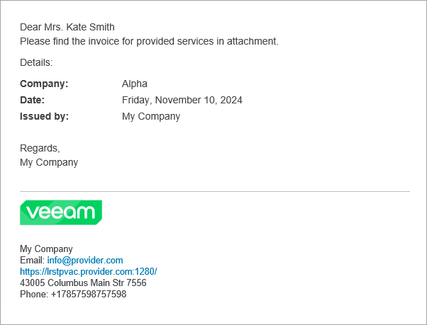

# Configuring Invoice Appearance and Billing Notifications

Before you generate invoices and send them to managed companies, you must customize invoice appearance settings and configure billing notifications. Use the following procedures to make sure you completed all required configuration steps.

Required Privileges

To perform this task, a user must have the following role assigned: Portal Administrator.

Customizing Invoice Appearance

Before you generate invoices, you must complete the following configuration steps:

1. [Fill in the company profile](fill_company_profile.md).

Specify your company name and contact details in the company profile. This information will be displayed in the From section of invoices.

1. [Customize portal branding](customize_branding.md).

Upload a custom report logo that must be displayed in invoices.

1. [Register a company account and specify contact details](create_companies.md).

Specify a company name, address and details of a contact person. This information will be displayed in the To section of invoices.

The following image illustrates what an invoice looks like.

Configuring Billing Notifications

A billing notification is an email message with an attached invoice that is sent to a managed company.

To configure Veeam Service Provider Console to send billing notifications:

1. [Fill in the company profile](fill_company_profile.md).

Specify your company name and contact details in the company profile. This information will be displayed in the billing notification footer.

1. [Customize portal branding](customize_branding.md).

Upload a custom report logo and specify the portal web address. The report logo and portal web address will be displayed in the billing notification footer.

1. [Configure SMTP server settings](configure_email_settings.md#smtpServer).

Specify settings of an SMTP server that will be used to send billing notifications.

1. [Configure notification settings](configure_email_settings.md#global).

In the billing notification settings, specify a sender address and a subject for billing notifications.

1. [Register a Company account, specify contact details and recipient](create_companies.md).

In the company account settings, specify a company name, address, name and email address of a contact person. Company details will be displayed in the billing notification body. Billing notifications will be sent at the email addresses specified in the Company Owner and Company Invoice Auditor accounts settings.

1. Choose how to send billing notifications.

* [Schedule automatic delivery of billing notifications](schedule_invoices.md).

You can schedule automatic generation of invoices and delivery of billing notifications to automate the process of sending recurring invoices.

* [Send billing notifications manually](send_invoices.md).

You can generate invoices and send billing notifications manually.

The following image illustrates what a billing notification looks like.

