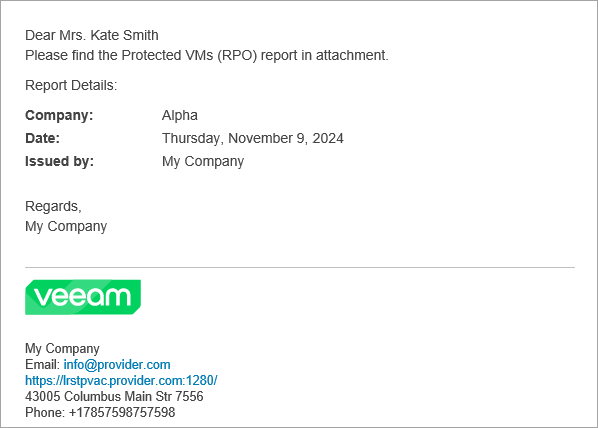

# Configuring Report Logo and Report Notifications

Before you run reports and send them to managed companies, you can customize report appearance settings and configure reporting notifications. Use the following check lists to make sure you completed all required configuration steps.

Customizing Report Logo

Before you generate backup reports, upload a custom report logo. The logo will be displayed at the top right corner of backup reports.

For details, see [Customizing Portal Branding](customize_branding.md).

Configuring Report Notifications

A report notification is an email message with an attached backup report that is sent to a managed company.

To configure Veeam Service Provider Console to send report notifications:

1. [Fill in the company profile](fill_company_profile.md).

Specify your company name and contact details in the company profile. This information will be displayed in the report notification footer.

1. [Customize portal branding](customize_branding.md).

Upload a custom report logo and specify the portal web address. The report logo and portal web address will be displayed in the report notification footer.

1. [Configure SMTP server settings](configure_email_settings.md#smtpServer).

Specify settings of an SMTP server that will be used to send report notifications.

1. [Register a Company Owner account, specify contact details and recipient](create_companies.md).

In the company account settings, specify a company name, address, name and email address of a contact person. Company details will be displayed in the report notification body. Report notifications will be sent at the email address specified in the Company Owner account settings.

The following image illustrates what a backup report notification looks like.

