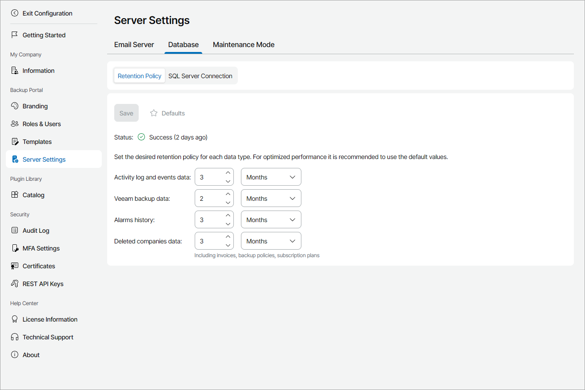

# Configuring Retention Settings

On the Retention Policy tab, you can check the status of the latest retention session and modify the period for which historical data must be stored in the Veeam Service Provider Console database.

Required Privileges

To perform this task, a user must have the following role assigned: Portal Administrator.

Configuring Retention Settings

To modify retention settings:

1. Log in to Veeam Service Provider Console.

For details, see [Accessing Veeam Service Provider Console](access_vac.md).

1. At the top right corner of the Veeam Service Provider Console window, click Configuration.
2. In the configuration menu on the left, click Server Settings.
3. Open the Database tab and navigate to Retention Policy.
4. On the Retention Policy tab, check the status of the latest retention session in the Status field, and if necessary, change data retention settings.

1. In the Activity log and events data section, specify a period for which Veeam Service Provider Console must keep [task and activity log data](view_task_activity_data.md).

The default retention period for activity log and events data is 3 months.

1. In the Veeam backup data section, specify a period for which Veeam Service Provider Console must keep historical information about [Veeam Backup & Replication jobs](manage_backup_jobs.md) and [Veeam backup agent jobs](manage_backup_agent_jobs.md).

The default retention period for data protection job history is 2 months.

1. In the Alarms history section, specify a period for which Veeam Service Provider Console must keep historical information about [triggered alarms](view_triggered_alarms.md).

The default retention period for alarm history is 3 months.

1. In the Deleted companies data section, specify a period for which Veeam Service Provider Console must keep historical information about [deleted companies](manage_tenants.md), including information about invoices, backup policies, and subscription plans.

The default retention period for alarm history is 3 months.

1. Click Save.

To restore default retention settings, click Defaults, and then click Save.

