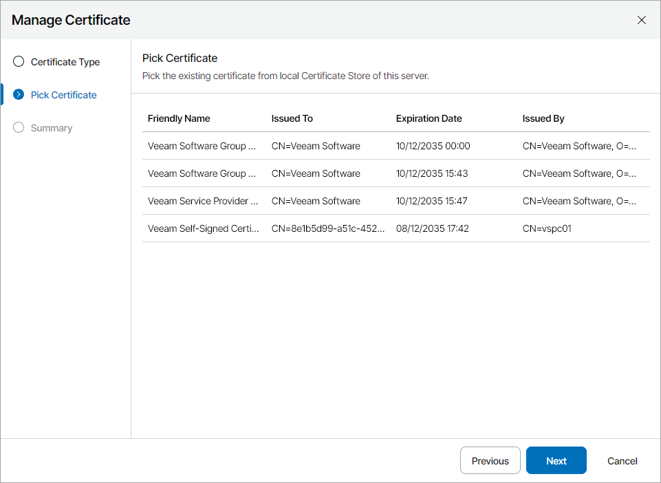
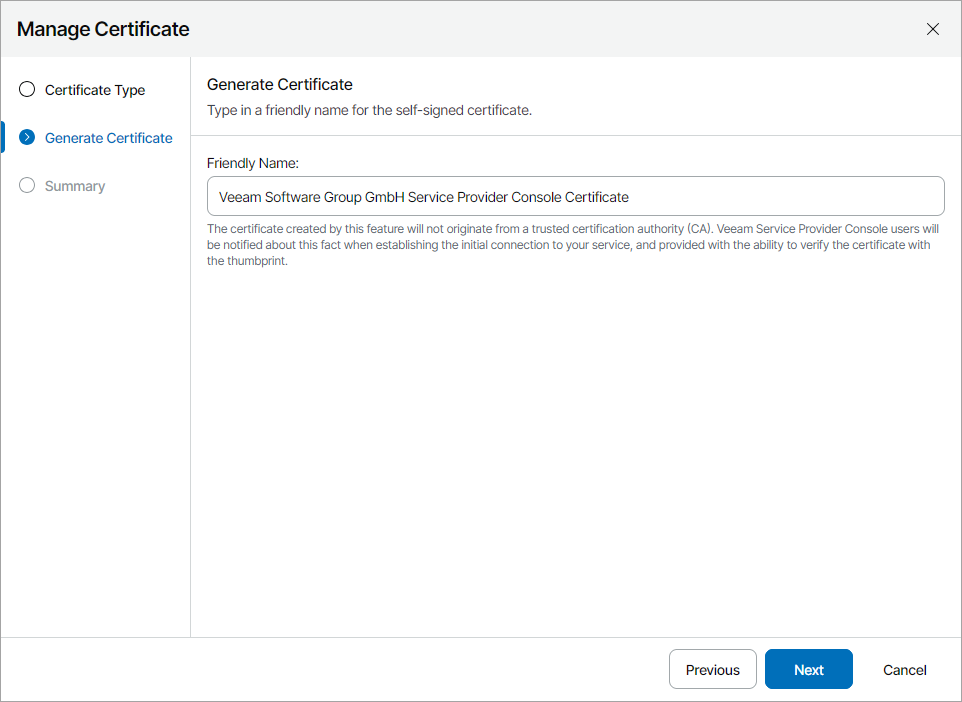

# Configuring Server Certificate

When you configure Veeam Service Provider Console Server certificate, you can specify what TLS certificate must be used. Veeam Service Provider Console offers the following options:

* [Import an existing TLS certificate from the certificate store](#import_certificate_from_store). This is the recommended option.
* Keep the default self-signed TLS certificate generated by Veeam Service Provider Console during installation or upgrade.
* [Generate a new self-signed TLS certificate](#generate_new_certificate).

Importing Certificate from Certificate Store

To establish a secure connection with Veeam Service Provider Console management agents, a Veeam Service Provider Console Server certificate must be a multi-domain or wildcard TLS certificate signed by a CA and located in the Microsoft Windows certificate store. The certificate must meet the following requirements:

* For a multi-domain certificate:

* The certificate subject is equal to the fully qualified domain name (FQDN) of the Veeam Service Provider Console server. For example: CN = vac.domain.local.
* The Subject Alternative Name field must contain the FQDN of the Veeam Service Provider Console server. For example: DNS:vac.domain.local. If you want the certificate to cover cloud gateways, the filed must also contain all cloud gateway FQDNs.

* For a wildcard certificate:

* The certificate subject is equal to the wildcard domain entry of the Veeam Service Provider Console server. For example: CN = \*.domain.local.
* The Subject Alternative Name field must contain the wildcard domain entry of the Veeam Service Provider Console server. For example: DNS:\*.domain.local. If you want the certificate to cover cloud gateways, the field must also contain the wildcard domain entries of cloud gateways. Otherwise, these cloud gateways will not be trusted. Management agents will not use them for communication with Veeam Service Provider Console server.

* The minimum key size is 2048 bits. 4096 bits is recommended.

* The following key usage extensions are enabled in the certificate: Digital Signature, Non-Repudiation, Key Encipherment, Data Encipherment.

* The enhanced key usage must be Server Authentication (1.3.6.1.5.5.7.3.1).

|  |
| --- |
| Note: |
| It is recommended to use different TLS certificates for Veeam Cloud Connect and Veeam Service Provider Console server in distributed deployments. Using the same certificate on multiple machines may compromise the private key of the certificate. |

To import a certificate from the Microsoft Windows certificate store, do the following on the machine where Veeam Service Provider Console Server component is installed:

1. Log in to Veeam Service Provider Console.

For details, see [Accessing Veeam Service Provider Console](access_vac.md).

1. At the top right corner of the Veeam Service Provider Console window, click Configuration.
2. In the configuration menu on the left, click Certificates.
3. At the top of the list, click Install > Server.
4. At the Certificate Type step of the Manage Certificate window, select the Select certificate from the certificate store option.
5. At the Pick Certificate step, select a certificate that you want to install and click Next.

|  |
| --- |
| Note: |
| Consider the following:   * You can select only certificates that contain both a public key and a private key. Certificates without private keys are not displayed in the list. * The certificate must be installed in the Local Computer or Personal certificate store. * Make sure that an account used to install security certificates has access to private keys of the certificates. |

1. Review the certificate settings and click Finish.
2. Log on as Administrator to the machine where Veeam Service Provider Console Server component is installed.
3. Restart the Veeam Management Portal service.
4. Refresh the Veeam Service Provider Console portal page.

Generating New Self-Signed Certificate

To generate self-signed TLS certificates, Veeam Service Provider Console uses RSA algorithm with a 2048-bit key length and SHA-2 hashing algorithm. The created TLS certificate is saved to the Shared certificate store. The following types of users can access the generated TLS certificate:

* User who created the TLS certificate
* LocalSystem user account
* Local Administrators group

|  |
| --- |
| Note: |
| If you replace the default certificate with another self-signed certificate, you need to do the following:   * Import the new certificate to the client machines (the machines from which you plan to access Veeam Service Provider Console). For details on importing certificates, see [Microsoft Docs](https://docs.microsoft.com/en-us/previous-versions/windows/it-pro/windows-server-2008-R2-and-2008/cc754489%28v%3Dws.11%29). * Manually configure a trusted connection between Veeam Service Provider Console and management agents. For details, see [Deploying Management Agents Manually](deploy_management_agents.md). |

To generate a new self-signed TLS certificate, do the following:

1. Log in to Veeam Service Provider Console.

For details, see [Accessing Veeam Service Provider Console](access_vac.md).

1. At the top right corner of the Veeam Service Provider Console window, click Configuration.
2. In the configuration menu on the left, click Certificates.
3. At the top of the list, click Install > Server.
4. At the Certificate Type step of the Manage Certificate window, select the Generate new certificate option.
5. At the Generate Certificate step, specify a friendly name for a certificate that you want to install and click Next.

1. Review the certificate settings and click Finish.
2. Log on as Administrator to the machine where Veeam Service Provider Console Server component is installed.
3. Restart Veeam Management Portal service.
4. Refresh the Veeam Service Provider Console portal page.

Related Topics

[Certificate Validation Errors](appendix_errors.md)

