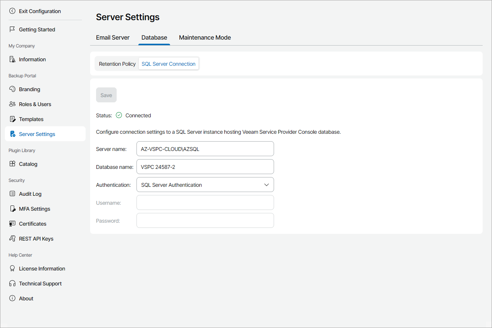
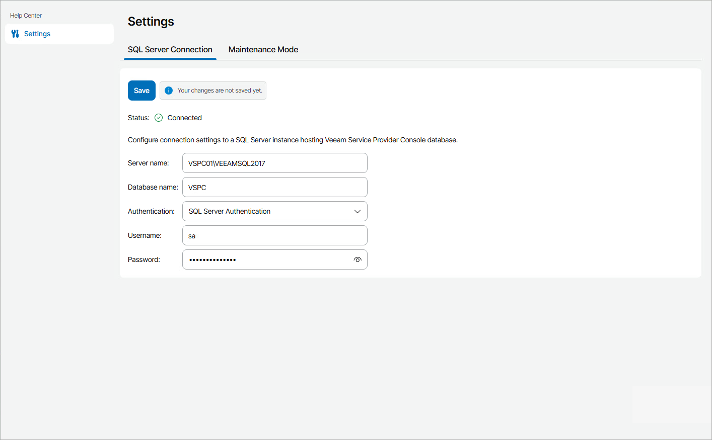

# Configuring SQL Server Connection Settings

Veeam Service Provider Console data is stored in a database hosted on a Microsoft SQL Server, and created as part of the deployment process. By default, the database is called VSPC. You can change the database name during Veeam Service Provider Console deployment.

By default, Veeam Service Provider Console connects to the Microsoft SQL Server using credentials specified in the Veeam Service Provider Console Setup wizard.

In some cases, you may need to change the default Microsoft SQL Server connection settings. This can be required if you want to change credentials or the authentication type for connecting to the SQL Server, or switch from the default database to a new one.

For details on how to optimize and maintain SQL Server instance, see [this Veeam KB article](https://www.veeam.com/kb4670).

Required Privileges

To perform this task, a user must have the following role assigned: Portal Administrator.

Changing SQL Server Connection Settings

To change SQL Server connection settings, perform the following steps:

1. Log in to Veeam Service Provider Console.

For details, see [Accessing Veeam Service Provider Console](access_vac.md).

1. At the top right corner of the Veeam Service Provider Console window, click Configuration.
2. In the configuration menu on the left, click Server Settings.
3. Open the Database tab and navigate to SQL Server Connection.
4. In the Server name field, specify a name of a Microsoft SQL Server instance that hosts the Veeam Service Provider Console database.
5. In the Database name field, specify a name of the Veeam Service Provider Console database.
6. From the Authentication list, select the type of authentication that Veeam Service Provider Console must use to connect to the Microsoft SQL Server.
7. [For SQL Server Authentication] In the User name and Password fields, specify credentials of the account that Veeam Service Provider Console must use to connect to the Microsoft SQL Server.
8. Click Save.

Changing Connection Settings when Connection to Database is Lost

In some situations, connection to a Microsoft SQL Server that hosts the Veeam Service Provider Console database can be lost. To change database connection settings, or switch Veeam Service Provider Console to a new database, perform the following steps:

1. Log on to a machine that runs Veeam Service Provider Console and stop Veeam Management Portal Service (VeeamManagementPortalSvc) service.

If you installed Veeam Service Provider Console using the distributed deployment scenario, this must be a machine that hosts the Veeam Service Provider Console Server component.

1. Switch Veeam Service Provider Console to the maintenance mode.

To do so, in the command prompt run the following command:

|  |
| --- |
| sc start VeeamManagementPortalSvc lightweight |

1. Log on to the machine that hosts Veeam Service Provider Console as a local administrator.

If you installed Veeam Service Provider Console using the distributed deployment scenario, log on to the machine that hosts the Veeam Service Provider Console Web UI component.

1. Log in to Veeam Service Provider Console.

For details, see [Accessing Veeam Service Provider Console](access_vac.md).

Note that to change database connection settings, you must log in using local host address:

https://localhost:1280

1. In the Server Settings section, open the Database tab and navigate to SQL Server Connection.
2. Specify settings for connecting to an existing or a new database as described in [Configuring SQL Server Connection Settings](configure_sql_connection.md).

* If you specify connection settings for an existing Veeam Service Provider Console database, Veeam Service Provider Console will connect to this database using the specified settings.
* If you specify the name of a database that does not yet exist on a Microsoft SQL Server, Veeam Service Provider Console will prompt to create a new database, and then will connect to it.

1. Click Save.
2. Refresh the Veeam Service Provider Console portal page.

Veeam Service Provider Console will connect to the specified database, and will automatically disable the maintenance mode.

