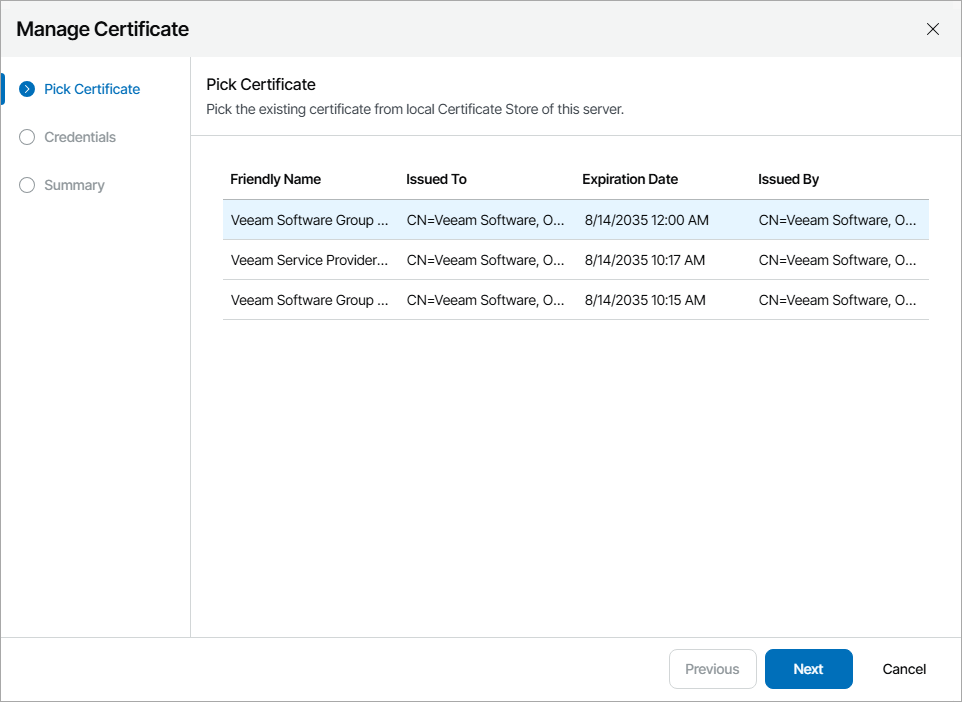

# Configuring Web UI Certificate

When you configure Veeam Service Provider Console Web UI certificate, you can specify what TLS certificate must be used. Veeam Service Provider Console offers the following options:

* [Import an existing TLS certificate from the certificate store](#import_certificate_from_store). This is the recommended option.
* Keep the default self-signed TLS certificate generated by Veeam Service Provider Console during installation or upgrade.

Importing Certificate from Certificate Store

To establish a secure connection with client applications, a Veeam Service Provider Console Web UI certificate must be a multi-domain TLS certificate signed by a CA and located in the Microsoft Windows certificate store. The certificate must meet the following requirements:

* The certificate subject is equal to the fully qualified domain name (FQDN) of the Veeam Service Provider Console server. For example: CN = vac.domain.local.
* The Subject Alternative Name field must contain the FQDN of the Veeam Service Provider Console server (for example: DNS:vac.domain.local) and all FQDNs used to access Veeam Service Provider Console web portal, Reseller Portal and Client Portal. For details on Client Portal, see [Guide for End Users](https://helpcenter.veeam.com/docs/vac/provider_user/about.html?ver=9.1). For details on Reseller Portal, see [Guide for Resellers](https://helpcenter.veeam.com/docs/vac/reseller/about.html?ver=9.1).

* The minimum key size is 2048 bits. 4096 bits is recommended.

* The following key usage extensions are enabled in the certificate: Digital Signature, Non-Repudiation, Key Encipherment, Data Encipherment.
* The enhanced key usage must be Server Authentication (1.3.6.1.5.5.7.3.1).

Alternatively, you can configure multiple port bindings with multiple certificates in your IIS Manager. For details, see [Microsoft Docs](https://docs.microsoft.com/en-us/iis/get-started/whats-new-in-iis-8/iis-80-centralized-ssl-certificate-support-ssl-scalability-and-manageability).

To import a certificate from the Microsoft Windows certificate store, do the following on the machine where Veeam Service Provider Console Web UI component is installed:

1. Log in to Veeam Service Provider Console.

For details, see [Accessing Veeam Service Provider Console](access_vac.md).

1. At the top right corner of the Veeam Service Provider Console window, click Configuration.
2. In the configuration menu on the left, click Certificates.
3. At the top of the list, click Install > Web UI.
4. At the Pick Certificate step of the Manage Certificate window, select a certificate that you want to install and click Next.

|  |
| --- |
| Note: |
| Consider the following:   * You can select only certificates that contain both a public key and a private key. Certificates without private keys are not displayed in the list. * The certificate must be installed in the Local Computer or Personal certificate store. * Make sure that an account used to install security certificates has access to private keys of the certificates. |

1. At the Credentials step, specify credentials of a local administrator of a machine on which Veeam Service Provider Console Web UI runs.
2. At the Summary step, review the certificate settings and click Finish.
3. Log on as Administrator to the machine where Veeam Service Provider Console Web UI component is installed.
4. Open the Internet Information Services Manager.
5. Expand the Sites list and select Veeam Service Provider Console.
6. In the menu on the right, click Restart.
7. Refresh the Veeam Service Provider Console portal page.

Related Topics

[Certificate Validation Errors](appendix_errors.md)

