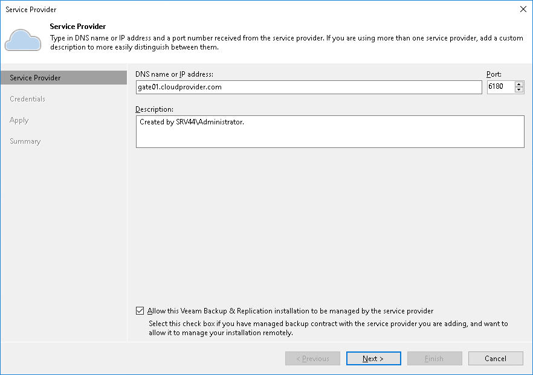

# Connecting Veeam Backup & Replication Servers

To manage Veeam Backup & Replication or Veeam Backup Enterprise Manager servers in Veeam Service Provider Console, you must first connect these servers to Veeam Service Provider Console.

When you connect a Veeam Backup & Replication or Veeam Backup Enterprise Manager server to Veeam Service Provider Console, a Veeam Service Provider Console management agent is deployed on this server. The management agent is responsible for transmitting commands from Veeam Service Provider Console to the backup server, performing management operations, collecting data from Veeam Backup & Replication and communicating it back to Veeam Service Provider Console. If Veeam ONE and Veeam Backup for Microsoft 365 servers are deployed on the same machine where Veeam Backup & Replication or Veeam Backup Enterprise Manager server is deployed, Veeam Service Provider Console management agent will collect data from all discovered products.

To install Veeam Service Provider Console management agents on Windows servers, you can run discovery of computers in client or hosted infrastructure. Management agents will be automatically installed on all discovered computers, including computers hosting Veeam Backup & Replication servers. For details on configuring discovery rules, see [Configuring Windows Discovery Rules](discovery_windows.md).

|  |
| --- |
| Note: |
| To perform Veeam Backup & Replication management actions in Veeam Service Provider Console, you must [allow](#allow_vbr_sp) the discovered Veeam Backup & Replication servers to be managed by the service provider. |

Alternatively, you can connect Veeam Backup & Replication servers manually:

* [Client Veeam Backup & Replication servers](#client)
* [Hosted Veeam Backup & Replication servers](#hosted)

Before You Begin

Before you connect Veeam Backup & Replication, make sure that the port used for communication with Veeam Service Provider Console is open on the machine hosting Veeam Backup & Replication.

Additionally, before you connect Linux Veeam Backup & Replication (Veeam Software Appliance), make sure to enable remote data collection in the Veeam Host Management Console. For details, see [Configuring Backup Infrastructure Settings](https://helpcenter.veeam.com/docs/vbr/userguide/hmc_configure_infrastructure.html?ver=13) in the Veeam Backup & Replication User Guide.

Connecting Client Veeam Backup & Replication Servers Using Veeam Backup & Replication Console

To connect a Veeam Backup & Replication server to Veeam Service Provider Console:

1. Do one of the following:

1. [For Windows Veeam Backup & Replication] Log on to a machine that runs Veeam Backup & Replication.

A user account under which you log on must have local Administrator privileges or the Veeam Backup Administrator role assigned in Veeam Backup & Replication.

1. [For Linux Veeam Backup & Replication] Log on to a machine where a Veeam Backup & Replication console is deployed.

1. Launch the Veeam Backup & Replication console.

* [For Windows Veeam Backup & Replication] Connect to localhost.
* [For Linux Veeam Backup & Replication] Specify the server address and credentials of a user account with the Veeam Backup Administrator role.

1. Open the Backup Infrastructure view.
2. In the inventory pane on the left, select Service Providers.
3. Click Add Service Provider on the ribbon.

Alternatively, you can right-click the Service providers node in the inventory pane and choose Add service provider, or click Add service provider in the main area on the right.

1. At the Service Provider step of the wizard, configure the following settings:

1. In the DNS name or IP address field, specify DNS name or IP address of a cloud gateway.

This can be any cloud gateway deployed on the service provider side.

1. In the Description field, specify description of the service provider.
2. In the Port field, specify the port on the cloud gateway that is used to transfer backup data to the cloud.

The default port number is 6180, and can be customized when a cloud gateway is deployed.

1. Select the Allow this Veeam Backup & Replication installation to be managed by the service provider check box.

When this check box is selected, Veeam Backup & Replication deploys a Veeam Service Provider Console management agent on a backup server. The management agent is downloaded from Veeam Service Provider Console.

If you do not select this check box, Veeam Service Provider Console will not collect any data from this Veeam Backup & Replication server. This server will not be displayed in the Veeam Service Provider Console portal and you will not be able to perform any management actions for this server from Veeam Service Provider Console.

You must specify credentials of the Company Tenant. These credentials are defined when a cloud tenant account is created in Veeam Service Provider Console, or a tenant is created in Veeam Cloud Connect. For details, see [Creating Cloud Tenants](create_cloud_tenant.md).

1. Follow the remaining steps of the wizard. At the last wizard step, click Finish.

If the Veeam Backup & Replication server is a primary node of a High Availability cluster, Veeam Service Provider Console will automatically register the server as a cluster node. After the primary node is connected, you must connect the secondary node as described in [Managing Backup High Availability Clusters](vbr_ha_clusters.md#connect).

For details on connecting to service providers, see section [Connecting to Service Providers](https://helpcenter.veeam.com/docs/backup/cloud/cloud_connect_sp.html) of the Veeam Cloud Connect Guide.

|  |
| --- |
| Important! |
| * Do not connect a Veeam Backup & Replication server that is already connected to Veeam Service Provider Console using different credentials, as it will cause Veeam Service Provider Console to display the collected data incorrectly. * If connected Veeam Backup & Replication server has MFA enabled, it may have an Inaccessible status in Veeam Service Provider Console. To resolve the issue, refer to [this Veeam KB article](https://www.veeam.com/kb4431). |

Connecting Hosted Veeam Backup & Replication Servers

To connect a hosted Veeam Backup & Replication server, you must install the management agent on a machine running Veeam Backup & Replication server. When the agent is installed on a hosted Veeam Backup & Replication server, Veeam Service Provider Console can manage and monitor this server. Note that only Portal Administrator can manage Veeam Backup & Replication jobs on hosted servers. For details on connecting Veeam Backup & Replication servers in Veeam Service Provider Console plugin, see [Connecting Veeam Backup & Replication Servers](vbr_connect_servers.md).

Alternatively, you can deploy the management agent on the hosted Veeam Backup & Replication server manually. For details, see [Deploying Management Agents Manually](deploy_management_agents.md).

Connecting Veeam Backup Enterprise Manager Servers

If Veeam Backup Enterprise Manager is present in the backup infrastructure, you can install the management agent on a machine running Veeam Backup Enterprise Manager. When the agent is installed on a Veeam Backup Enterprise Manager server, Veeam Service Provider Console can obtain data from this server and monitor its health state.

The Linux Veeam Backup Enterprise Manager server must be connected in Veeam Service Provider Console plugin. For details, see [Connecting Linux Veeam Backup Enterprise Manager Servers](vbr_connect_linux_em.md).

The management agent on the Veeam Backup Enterprise Manager server running on a Microsoft Windows machine must be deployed manually. For details, see [Deploying Management Agents Manually](deploy_management_agents.md).

|  |
| --- |
| Note: |
| You do not need to install the management agent if Veeam Backup Enterprise Manager is co-installed with a managed Veeam Backup & Replication. Veeam Service Provider Console will manage both products trough a single management agent. |

