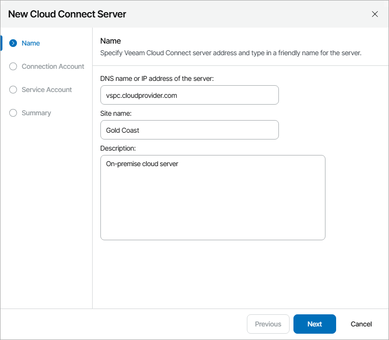
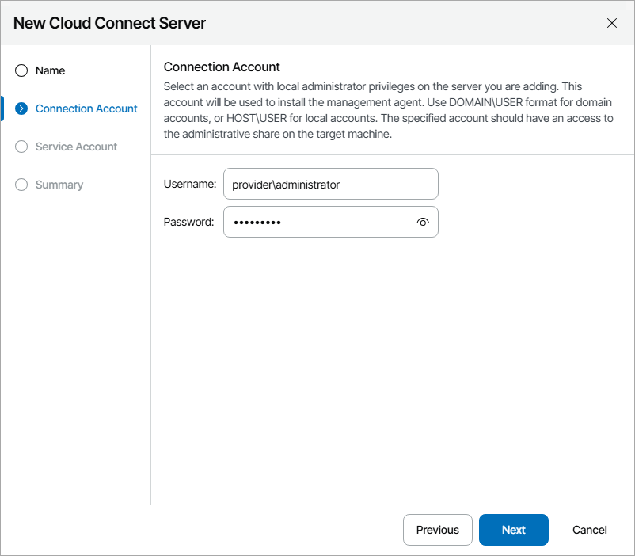
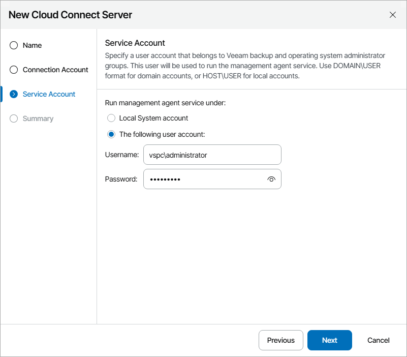
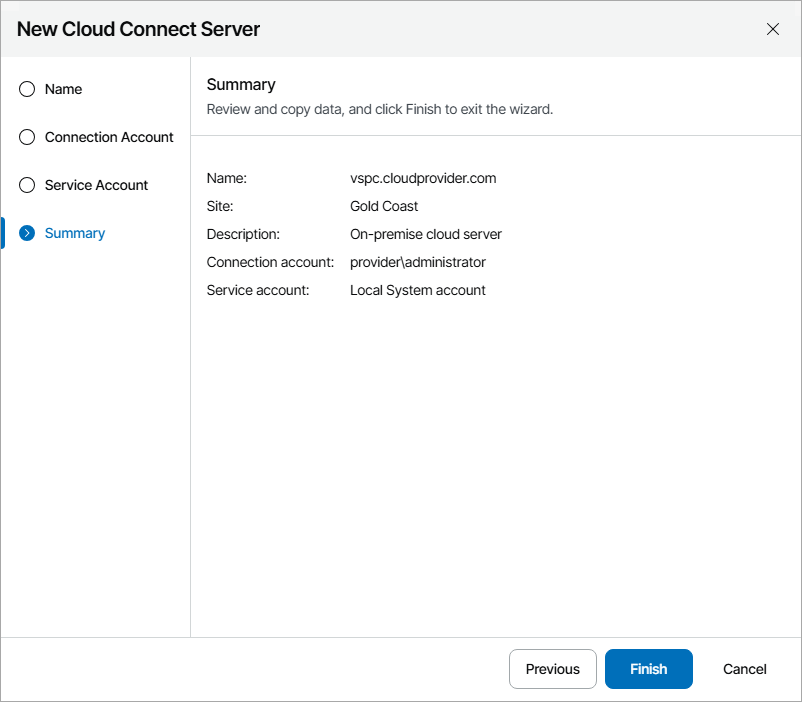

# Connecting Veeam Cloud Connect Servers

To allow Veeam Service Provider Console to communicate with the Veeam Cloud Connect server, you must configure a connection to this Veeam Cloud Connect server. When you connect the Veeam Cloud Connect server, Veeam Service Provider Console deploys its management agent on the Veeam Cloud Connect server.

You can add multiple Veeam Cloud Connect servers located at different sites.

Connecting Veeam Cloud Connect Servers

To configure a connection to the Veeam Cloud Connect server:

1. Log in to Veeam Service Provider Console.

For details, see [Accessing Veeam Service Provider Console](access_vac.md).

1. At the top right corner of the Veeam Service Provider Console window, click Configuration.
2. In the configuration menu on the left, click Catalog.
3. Click the Veeam Cloud Connect plugin tile.
4. In the menu on the left, click Servers.
5. At the top of the server list, click New.

Veeam Service Provider Console will launch the New Cloud Connect Server wizard.

1. At the Name step of the wizard, specify the following settings:

1. In the DNS name or IP address of the server field, type FQDN or IP address of the Veeam Cloud Connect server.
2. In the Site name field, specify the name of the site at which Veeam Cloud Connect server is located.
3. In the Description field, type server description or comments.

1. At the Connection Account step of the wizard, specify the credentials of a user account with local administrator privileges on the Veeam Cloud Connect server.

This account will be used to install a Veeam Service Provider Console management agent on the Veeam Cloud Connect server.

The user name must be specified in the DOMAIN\USERNAME format for domain accounts, or HOST\USERNAME format for local accounts.

1. At the Service Account step of the wizard, specify the account that will be used to run a management agent on the Veeam Cloud Connect server:

* Select Local System account, if you want to run management agent under the Local System account of the machine on which Veeam Cloud Connect server is installed.
* To use a different account, select The following user account and specify the credentials of a user account with Veeam Backup Administrator privileges in Veeam Backup & Replication on the Veeam Cloud Connect server and Local Administrator privileges on the machine on which Veeam Backup & Replication server is installed.

The user name must be specified in the DOMAIN\USERNAME format for domain accounts, or HOST\USERNAME format for local accounts.

For details on Veeam Backup & Replication users, roles and privileges, see section [Managing Users and Roles](https://helpcenter.veeam.com/docs/vbr/userguide/users_roles.html?ver=13) of the Veeam Backup & Replication User Guide.

1. At the Summary step of the wizard, review connection settings and click Finish.

1. Repeat steps 4–8 for all Veeam Cloud Connect servers that you want to add.

