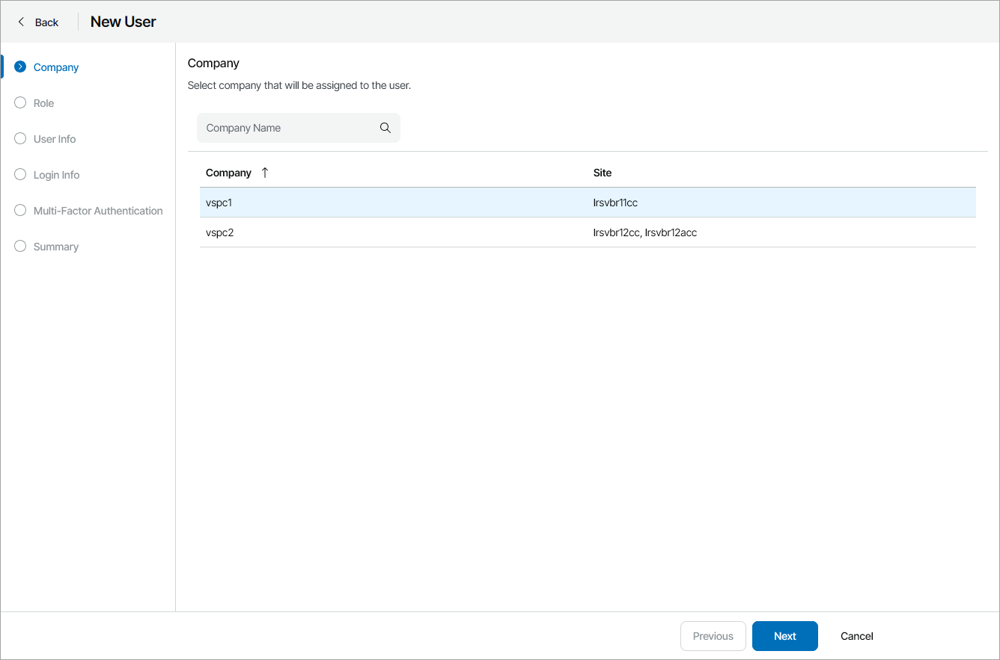
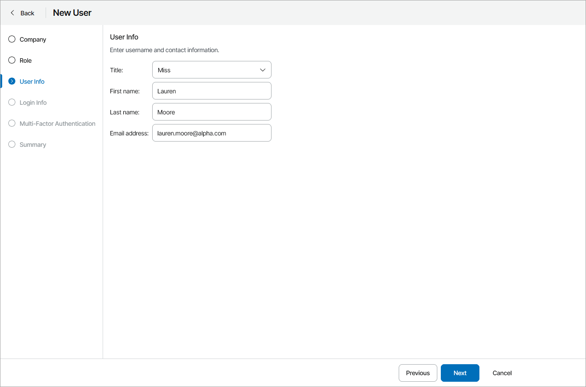
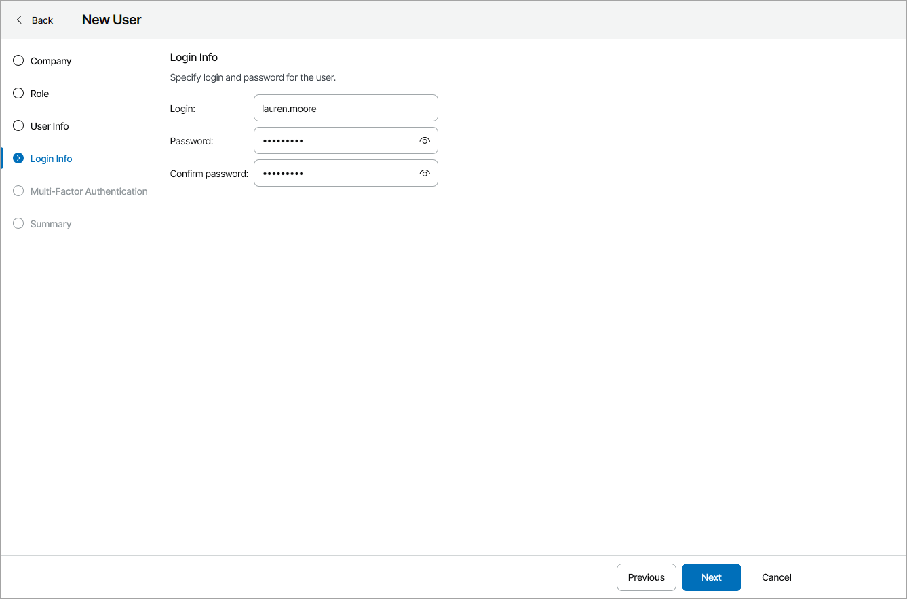
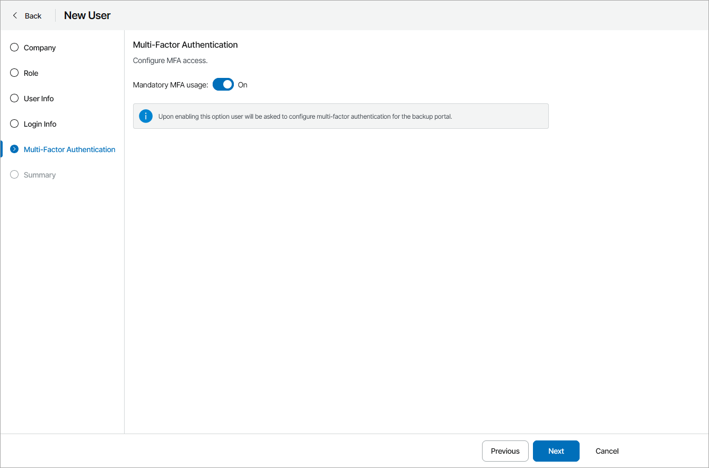
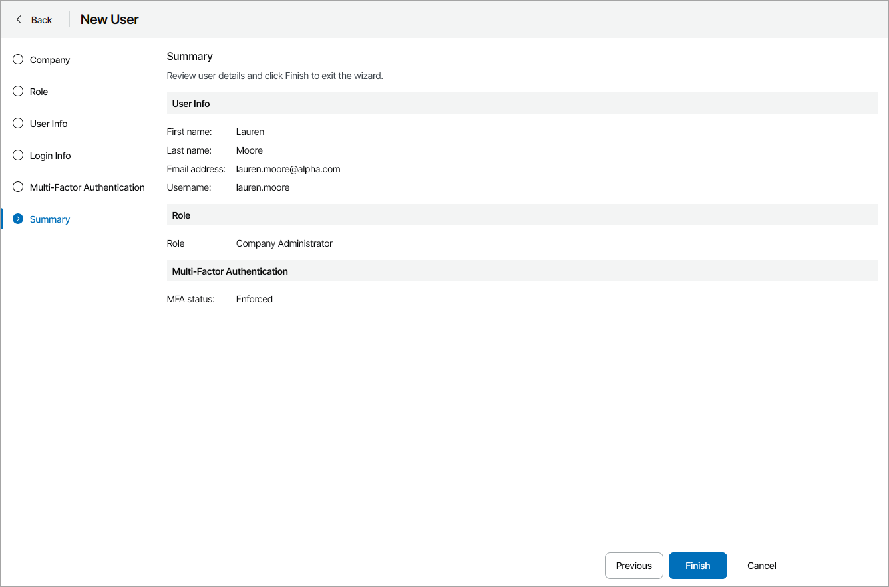

# Creating Company Administrators

You can create new users with the Company Administrator role:

1. Log in to Veeam Service Provider Console.

For details, see [Accessing Veeam Service Provider Console](access_vac.md).

1. At the top right corner of the Veeam Service Provider Console window, click Configuration.
2. In the configuration menu on the left, click Roles & Users.
3. Open the Managed Companies tab and navigate to Local Users.
4. On the Local Users tab, click New.

Alternatively, you can right-click the user list and choose New.

Veeam Service Provider Console will launch the New User wizard.

1. At the Company step of the wizard, select the company for which the user will be created.

1. At the Role step of the wizard, choose Company Administrator.
2. At the User Info step of the wizard, specify user title, first name, last name, and email address.

Veeam Service Provider Console can use this address to send email notifications to the user, such as password reset notifications and so on.

1. At the Login Info step of the wizard, in the Login, Password and Confirm password fields, type a user login name and password.

It is recommended to use a password that contains characters from at least 3 of the following categories: uppercase characters, lowercase characters, base 10 digits (0 through 9), non-alphanumeric characters. The recommended password length is 6 or more characters.

1. At the Multi-Factor Authentication step of the wizard you can assign a second authentication factor to the new user. For details on MFA, see [Configuring Multi-Factor Authentication](mfa.md).

To enable MFA for the new user, set the Mandatory MFA usage toggle to On. On the next authorization session, the user will be prompted to configure MFA.

1. At the Summary step of the wizard, review user details and click Finish.

