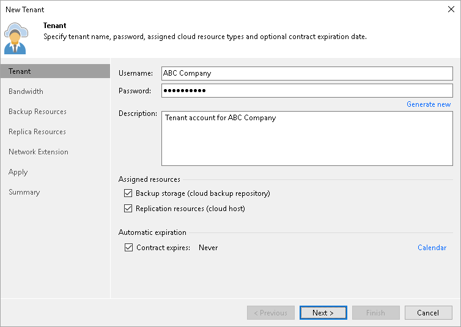

# Creating Cloud Tenant Accounts in Veeam Cloud Connect

You can create cloud tenant accounts in Veeam Backup & Replication, on the Veeam Cloud Connect server.

To create a cloud tenant account:

1. Log on to the Veeam Cloud Connect server.
2. Launch the Veeam Backup & Replication console.
3. Open the Cloud Connect view.
4. Create a new tenant account.

For details, see section [Registering Tenant Accounts](https://helpcenter.veeam.com/docs/backup/cloud/cloud_connect_tenant.html) of the Veeam Cloud Connect Guide.

The created tenant will be imported as a cloud tenant in Veeam Service Provider Console.

|  |
| --- |
| Note: |
| Consider the following:   * You cannot create tenants in Veeam Backup & Replication console if Veeam Cloud Connect management mode is set to Service Provider Console. For details, see [Configuring Tenant Management Mode](cloud_tenant_management.md). * The Username specified in Veeam Cloud Connect will be used as a Company Tenant user name in Veeam Service Provider Console after the created cloud tenant is mapped to a Veeam Service Provider Console company. For example, if the Username in Veeam Cloud Connect is Delta and the cloud tenant is mapped to a company Alpha, the Company Tenant must specify Alpha\Delta to log in to Veeam Service Provider Console.  * Some tenant details required in Veeam Service Provider Console will be missing for the account registered in Veeam Cloud Connect. You will need to fill out the missing tenant details as described in [Creating Cloud Tenants in Veeam Service Provider Console](create_tenant_in_vspc.md). |

