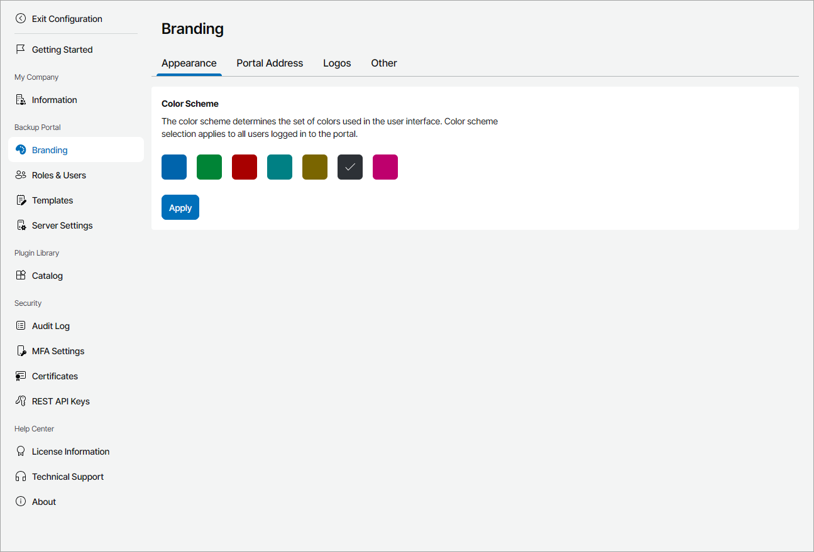
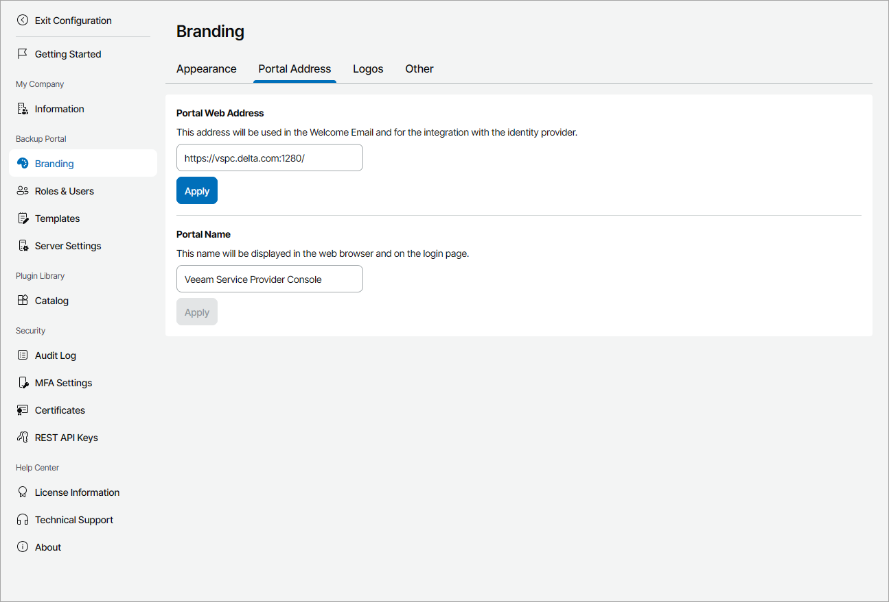
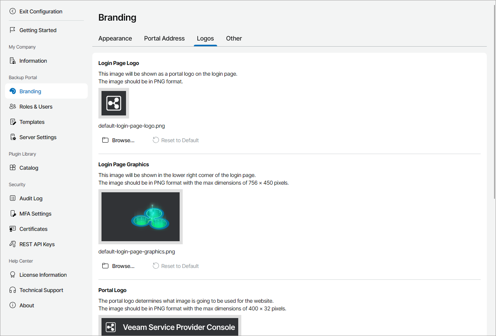
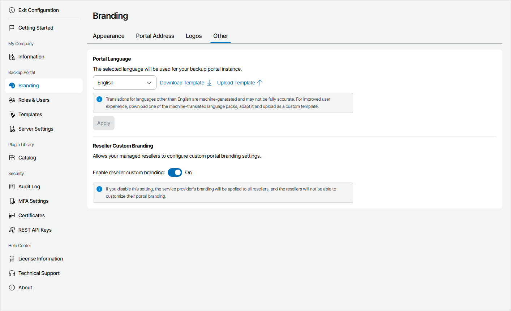
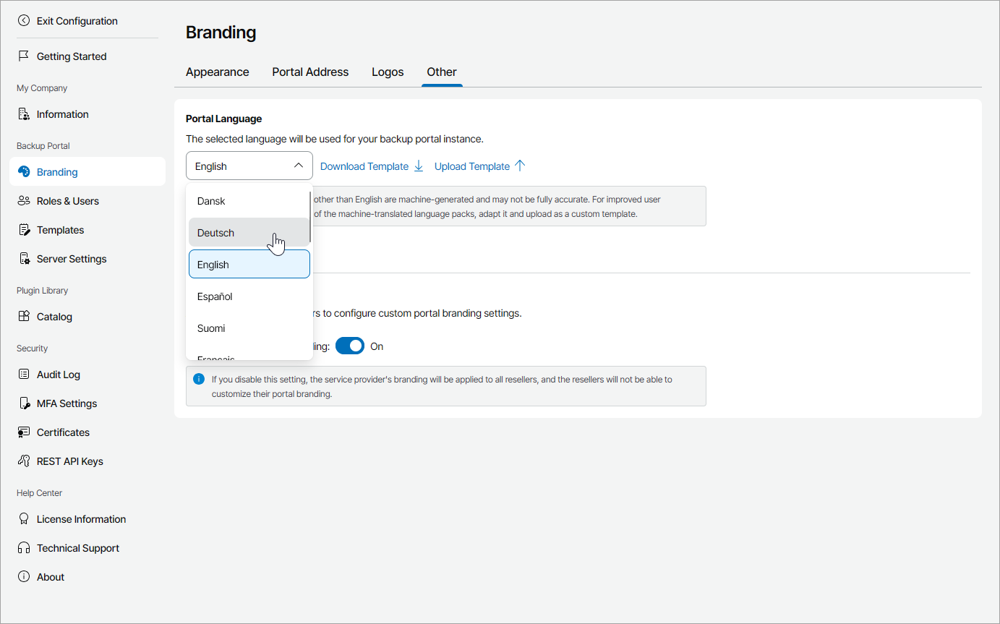

# Customizing Portal Branding

You can  customize the following branding settings for your Veeam Service Provider Console portal:

* [Appearance](#appearance)
* [Portal address](#address)
* [Logos](#logos)
* [Reseller branding](#reseller_branding)
* [Portal language](#language)

Required Privileges

To perform this task, a user must have  the following role assigned: Portal Administrator.

Customizing Portal Appearance

To change the color scheme of the Veeam Service Provider Console portal:

1. Log in to Veeam Service Provider Console.

For details, see [Accessing Veeam Service Provider Console](access_vac.md).

1. At the top right corner of the Veeam Service Provider Console window, click Configuration.
2. In the configuration menu on the left, click Branding and navigate to the Appearance tab.
3. Select the tile with the color that you want to use: Blue, Green, Red, Turquoise, Yellow, Grey or Pink.
4. Click Apply.

The color scheme you select will be visible to all portal users, including users in your organization, managed companies, and reseller companies if you do not enable custom portal branding.

Customizing Portal Address

To change the default name and website address of the Veeam Service Provider Console portal:

1. Log in to Veeam Service Provider Console.

For details, see [Accessing Veeam Service Provider Console](access_vac.md).

1. At the top right corner of the Veeam Service Provider Console window, click Configuration.
2. In the configuration menu on the left, click Branding and navigate to the Portal Address tab.
3. In the Portal Web Address field, check the URL of the Veeam Service Provider Console.

By default, the URL consists of the  FQDN or IP address of the machine on which Veeam Service Provider Console is installed, and the website port specified during installation. Note that the Veeam Service Provider Console portal is available over HTTPS.

If necessary, change the URL and click Apply. Make sure that the FQDN of the new URL is listed in the Subject or Subject Alternative Name (SAN) field of the Veeam Service Provider Console Web UI certificate. For details, see [Configuring Web UI Certificate](configure_web_ui_certificate.md).

The portal web address is displayed in email notifications sent by Veeam Service Provider Console, such as welcome or alarm notifications. Client users can access the portal by clicking the URL in email notifications.

The portal web address is also used for configuring integration with identity providers. For details, see [Managing Identity Providers](sso_idp.md).

1. In the Portal Name field, specify the name that will be displayed on the web browser tab and login page. Click Apply.

Customizing Logos

To replace the default company logos displayed in Veeam Service Provider Console portal, invoices, backup reports and email notifications:

1. Log in to Veeam Service Provider Console.

For details, see [Accessing Veeam Service Provider Console](access_vac.md).

1. At the top right corner of the Veeam Service Provider Console window, click Configuration.
2. In the configuration menu on the left, click Branding and navigate to the Logos tab.
3. To upload a login page logo:

1. In the Login Page Logo section, click Browse.
2. Specify a path to the image that must be displayed on the Veeam Service Provider Console login page and click Open.

The image must be in the PNG format without transparency. The image maximum dimensions must be 48 x 48 pixels.

To restore the default login page logo, click Reset to Default.

1. To upload a login page graphic:

1. In the Login Page Graphics section, click Browse.
2. Specify a path to the image that must be displayed at the bottom right corner of the Veeam Service Provider Console login page and click Open.

The image must be in the PNG format without transparency. The image maximum dimensions must be 756 x 450 pixels.

To restore the default login page logo, click Reset to Default.

1. To upload a portal logo:

1. In the Portal Logo section, click Browse.
2. Specify a path to the image that must be displayed at the top left corner of the Veeam Service Provider Console window and click Open.

The image must be in the PNG format without transparency. The image maximum dimensions must be 400 x 32 pixels.

To restore the default report logo, click Reset to Default.

1. To upload a report logo:

1. In the Report Logo section, click Browse.
2. Specify a path to the image that must be displayed in invoices, backup reports and email notifications, and click Open.

The image must be in the PNG format without transparency. The image maximum dimensions must be 200 x 45 pixels.

To restore the default portal logo, click Reset to Default.

1. To upload a website icon:

1. In the Web Site Icon section, click Browse.
2. Specify a path to the image that must be displayed as a website icon (favicon) for Veeam Service Provider Console and click Open.

The image must be in the ICO format. The image dimensions must be 16 x 16 pixels.

To restore the default website icon, click Reset to Default.

Configuring Reseller Branding

By default, custom branding is enabled for all managed resellers. If you disable this option, Veeam Service Provider Console will apply your branding settings for all resellers. Resellers will only be able to change the portal web address.

To disable custom branding for resellers:

1. Log in to Veeam Service Provider Console.

For details, see [Accessing Veeam Service Provider Console](access_vac.md).

1. At the top right corner of the Veeam Service Provider Console window, click Configuration.
2. In the configuration menu on the left, click Branding and navigate to the Other tab.
3. Set the Enable reseller custom branding toggle to Off.

Configuring Portal Language

To change the Veeam Service Provider Console portal language:

1. Log in to Veeam Service Provider Console.

For details, see [Accessing Veeam Service Provider Console](access_vac.md).

1. At the top right corner of the Veeam Service Provider Console window, click Configuration.
2. In the configuration menu on the left, click Branding and navigate to the Other tab.
3. In the Portal Language section, select the necessary language from the list and click Apply.

If you want to add a new language to Veeam Service Provider Console, you can upload a custom language package:

1. Log in to Veeam Service Provider Console.

For details, see [Accessing Veeam Service Provider Console](access_vac.md).

1. At the top right corner of the Veeam Service Provider Console window, click Configuration.
2. In the configuration menu on the left, click Branding and navigate to the Other tab.
3. In the Portal Language section, click Download Template.

The ZIP archive with JSON files will be saved to the default download location on your computer.

1. Replace the necessary lines in the JSON files.

Note that you must not change names of the text variables. For example:

|  |
| --- |
| "ADD\_ITEM\_TO\_BACK\_UP": "Add at least one item to back up." |

In this variable ADD\_ITEM\_TO\_BACK\_UP is the variable name that must not be modified. "Add at least one item to back up." is the text value that can be translated to another language.

1. Save the updated files as a ZIP archive.

Make sure the archive structure is the same as in the archive template.

1. Return to Veeam Service Provider Console portal.
2. In the Portal Language section, click Upload Template and select the ZIP archive with the customized texts.

The uploaded language template will be displayed as Custom.

