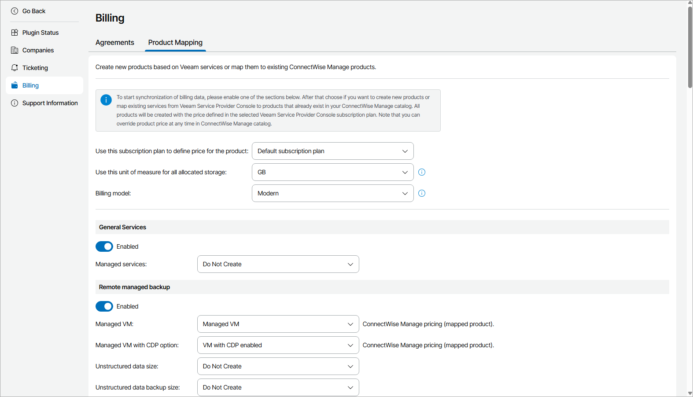
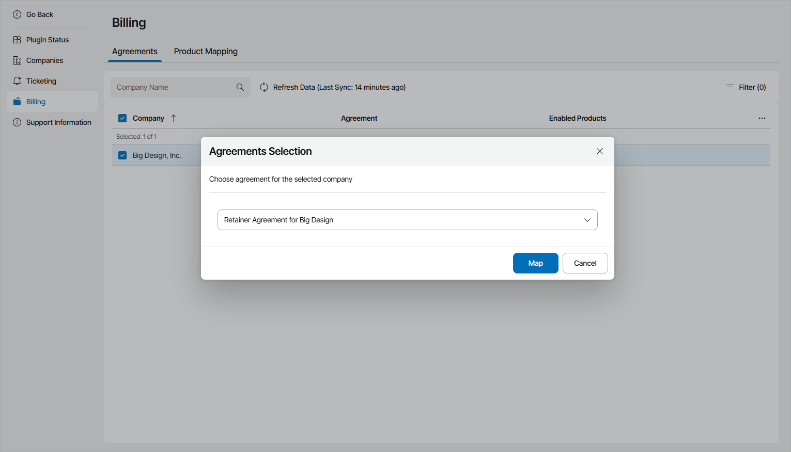
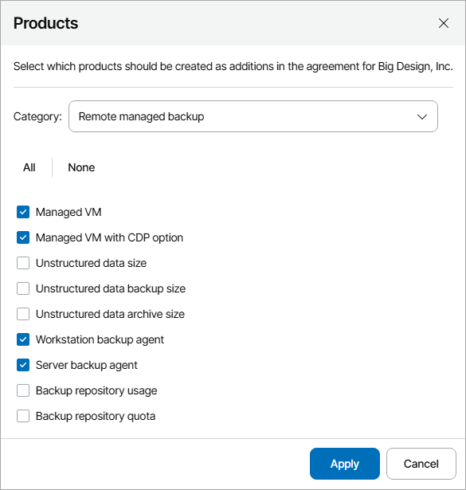

# Configuring Consolidated Billing

You can configure Veeam Service Provider Console to continuously send information to ConnectWise Manage about types and amount of services consumed by mapped companies. ConnectWise Manage will use this data to create additions to agreements and generate consolidated invoices.

|  |
| --- |
| Note: |
| In ConnectWise Manage invoices, the amount of services is displayed as quantity of additions. The quantity is calculated at the date when you generate an invoice in ConnectWise Manage and depends on the type of service:   * For services measured by actual numbers, the quantity is equal to the actual number of managed objects or amount of consumed space as of the date when an invoice is generated. * For services measured for a billing period, the quantity is equal to the amount of resources consumed for a period between two successive invoices.   Note that for the first ConnectWise Manage invoice the billing period starts from the company creation date. For example, if the company was created in March and ConnectWise Manage integration was configured in August, the first invoice will include the amount of resources consumed for 5 months. The next invoice will only include the amount of resources consumed for one month.  ConnectWise Manage invoice will include the exact storage usage even if you have configured to round up storage usage costs in the subscription plan.  The amount of services provided free of charge is defined by the selected subscription plan.  Make sure that the measurement unit of the selected ConnectWise Manage product is equal to the measurement unit of the mapped Veeam Service Provider Console service. For details on the types of services, see [Measuring Amount of Consumed Services](measure_services.md). |

To configure billing consolidation, perform the following steps:

1. [Configure product mapping](cwm_billing.md#map_products).

Map services from Veeam Service Provider Console to products in ConnectWise Manage catalog.

1. [Select agreements](cwm_billing.md#agreement).

For every mapped company, select an agreement which ConnectWise Manage will use to generate invoices.

1. [Add products to agreements](cwm_billing.md#add_products).

Select products that will be created as additions in agreements.

Prerequisites

Before configuring consolidated billing, check the following prerequisites:

* Configure ConnectWise Manage Plugin connection. For details, see [Configure Plugin Connection](cwm_connect_plugin.md).
* Enable the Companies and Billing integration features. For details, see [Enable Integration Features](cwm_enable_features.md).
* Configure integration for the companies, for which you want to consolidate billing data. For details, see [Configuring Companies Integration](cwm_companies.md).
* The companies for which you want to consolidate billing data must have at least one agreement in ConnectWise Manage. For details, see [ConnectWise Manage Documentation](https://docs.connectwise.com/ConnectWise_Documentation).

Step 1. Configure Product Mapping

Enable Veeam Service Provider Console services that you want to include as additions into ConnectWise Manage:

1. Log in to Veeam Service Provider Console.

For details, see [Accessing Veeam Service Provider Console](access_vac.md).

1. At the top right corner of the Veeam Service Provider Console window, click Configuration.
2. In the configuration menu on the left, click Catalog.
3. Click the ConnectWise Manage plugin tile.
4. In the menu on the left, click Billing.
5. Navigate to the Product Mapping tab.
6. At the top of the products list, select a subscription plan from which you want to obtain product costs and a measurement unit for allocated storage space.

|  |
| --- |
| Note: |
| If you have upgraded Veeam Service Provider Console from version 8.1 to version 9 or later, you must select a billing model that you want to use:   * Select the Legacy billing model if you want to charge for remote and hosted services together. * Select the Modern billing model if you want to configure separate charges for remote and hosted services.   If you have directly installed Veeam Service Provider Console version 9 or later, you will only have the Modern billing model available. |

1. Under the name of a Veeam Service Provider Console service group, set a toggle to Enabled.
2. For each service in the service group, select a necessary option from the drop-down list:

* Existing ConnectWise Manage product

In this case, Veeam Service Provider Console will map the service to the selected active ConnectWise Manage product.

* Create new product option

In this case, Veeam Service Provider Console will create a new product in ConnectWise Manage Procurement > Product Catalog and map it to the selected service. To define price for the new product, from the drop-down list at the top of the page, select a subscription plan. You can change this price at any time in ConnectWise Manage product catalog.

* Do not create option

In this case, Veeam Service Provider Console will skip the selected service and will not map it to any product in ConnectWise Manage.

1. At the bottom of the page, click Apply.

Step 2. Select Agreement

Select agreements to which you want to add Veeam Service Provider Console services:

1. Navigate to the Agreements tab.
2. From the list of mapped companies, select a company for which you want to add an agreement.
3. In the Agreement column, click the Select agreement link.
4. From the drop-down list, select a necessary agreement.

If a mapped company has only one agreement, it will be selected automatically.

1. Click Map.
2. Repeat steps 2–5 for all necessary companies.

Step 3. Add Products to Agreements

Add mapped products to the selected agreements:

1. From the list of mapped companies, select one or more companies for which you want to create additions in agreements.
2. In the Enabled Products column, click a link next to any of the selected companies.
3. In the Products window, for each service group from the Category drop-down list, select products that you want to add to agreements.

1. Click Apply.

Veeam Service Provider Console will create additions for the selected products to company agreements and start sending information about the quantity of consumed services to ConnectWise Manage.

