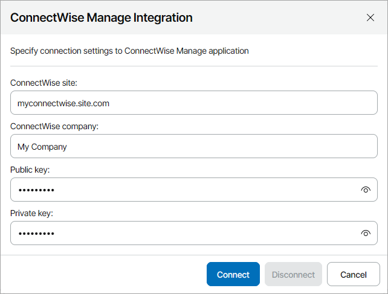
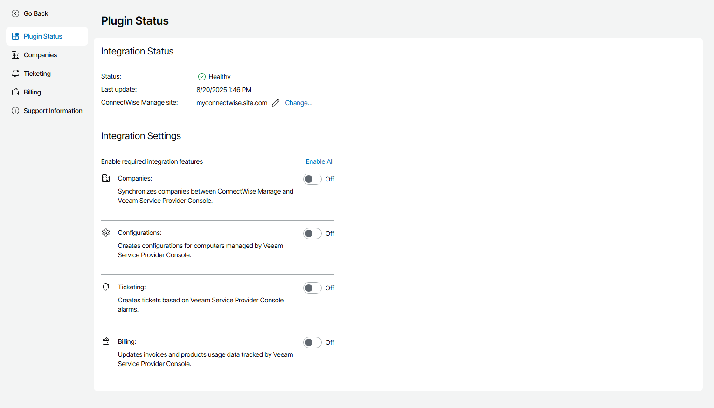

# Step 2. Configure Plugin Connection

Configure ConnectWise Manage plugin connection in Veeam Service Provider Console:

1. Log in to Veeam Service Provider Console.

For details, see [Accessing Veeam Service Provider Console](access_vac.md).

1. At the top right corner of the Veeam Service Provider Console window, click Configuration.
2. In the configuration menu on the left, click Catalog.
3. Click the ConnectWise Manage plugin tile.
4. In the ConnectWise Manage Integration window, specify connection settings:

* In the ConnectWise site field, type the URL of your ConnectWise site.
* In the ConnectWise company field, type the name of your company.
* In the Public key and the Private key fields, enter the API keys you generated at [Step 1. Obtain ConnectWise Manage API Keys](cwm_obtain_keys.md).

1. Click Connect.
2. In the ConnectWise Manage Integration window, check integration status.

A successfully established connection will show the Healthy integration status.

Disconnecting ConnectWise Manage Plugin

If you no longer want to manage a Veeam Service Provider Console server in ConnectWise Manage, you can remove plugin connection. After you disconnect ConnectWise Manage plugin, all integration between Veeam Service Provider Console and ConnectWise Manage will be disabled.

To disconnect ConnectWise Manage plugin:

1. Log in to Veeam Service Provider Console.

For details, see [Accessing Veeam Service Provider Console](access_vac.md).

1. At the top right corner of the Veeam Service Provider Console window, click Configuration.
2. In the configuration menu on the left, click Catalog.
3. Click the ConnectWise Manage plugin tile.
4. Click Change.
5. In the ConnectWise Manage Integration window, click Disconnect.
6. In the Connection Settings window, click Yes.

