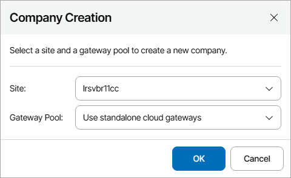

# Creating New Companies

You can create companies in Veeam Service Provider Console based on contact data from accounts of companies managed in ConnectWise Manage.

When you create a new company, Veeam Service Provider Console:

1. Retrieves company ID and data of company primary contact from ConnectWise Manage.
2. Creates an account based on retrieved information and maps it automatically to a source company in ConnectWise Manage.
3. [If you have selected to create a cloud tenant] Creates a cloud tenant account based on the retrieved information and assigns it automatically to the created Veeam Service Provider Console company.
4. [If the Send Welcome Email toggle is set to On] Sends a welcome email message at the address specified in the Company Info section of the company settings.

For details, see [Sending Welcome Email Message](send_welcome_email.md).

|  |
| --- |
| Note: |
| Veeam Service Provider Console will not be able to send a welcome email message until you configure SMTP server settings and global notification policy settings. For details, see [Configuring Notification Settings](configure_email_settings.md). |

Creating Companies

To create new companies in Veeam Service Provider Console:

1. Log in to Veeam Service Provider Console.

For details, see [Accessing Veeam Service Provider Console](access_vac.md).

1. At the top right corner of the Veeam Service Provider Console window, click Configuration.
2. In the configuration menu on the left, click Catalog.
3. Click the ConnectWise Manage plugin tile.
4. In the menu on the left, click Companies.

Veeam Service Provider Console will display a list of all companies managed in ConnectWise Manage.

1. From the list of companies, select unmapped ConnectWise Manage companies for which you want to create companies in Veeam Service Provider Console.

To narrow down the list of companies, you can apply the following filters:

* Company name — search companies by name configured in ConnectWise Manage.
* Type — limit the list of companies by type configured in ConnectWise Manage.
* Site — limit the list of companies by Veeam Cloud Connect server on which the company is registered.
* Status — limit the list of companies by mapping status (Mapped, Unmapped, Creating, Error).

1. At the top of the list, click Create Company.
2. [If you have several Veeam Cloud Connect sites or several gateway pools connected] In the Company Creation window, select the Veeam Cloud Connect server, in which you want to create the cloud tenant for the company, and the gateway pool that will be available to the cloud tenant.

If you do not want to create a cloud tenant for the company, from the Site drop-down list, select the No site (without tenant creation) option. In this case, you will have to map cloud tenant to the created company manually. For details, see [Configuring Cloud Tenant Mapping](assign_cloud_tenants.md).

|  |
| --- |
| Note: |
| If you want to provide backup or replication services to created companies, you must allocate resources to them. For details, see [Modifying Company Settings](modify_tenants.md). |

