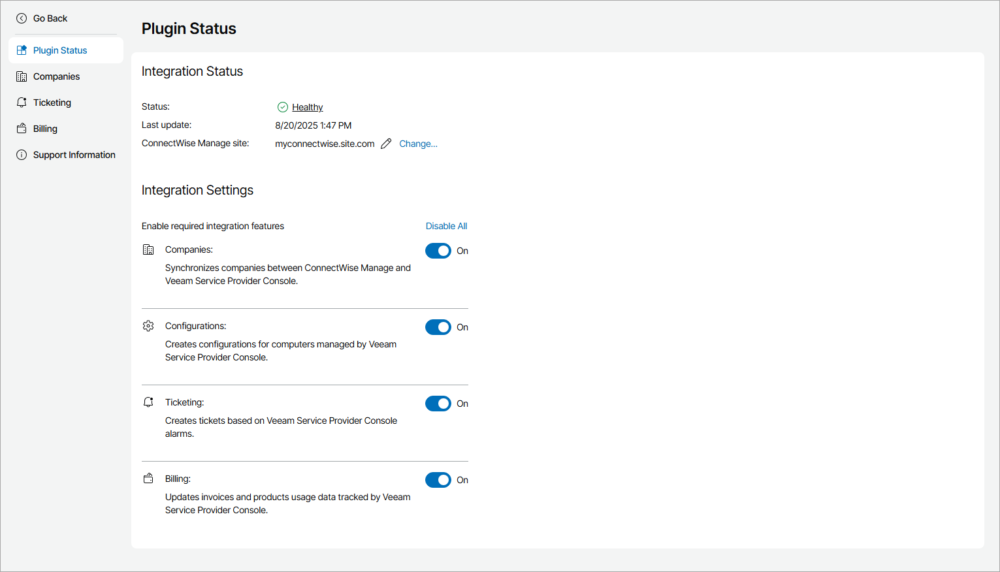

# Step 3. Enable Integration Features

Select information you want to share between Veeam Service Provider Console and ConnectWise Manage, and enable the necessary features:

1. Log in to Veeam Service Provider Console.

For details, see [Accessing Veeam Service Provider Console](access_vac.md).

1. At the top right corner of the Veeam Service Provider Console window, click Configuration.
2. In the configuration menu on the left, click Catalog.
3. Click the ConnectWise Manage plugin tile.
4. In the Integration Settings section, set toggles next to the necessary integration features to On.

You can also click the Enable All link to enable all integration features.

For details on integration features, see [Integration Features](integration_cwm.md#features).

