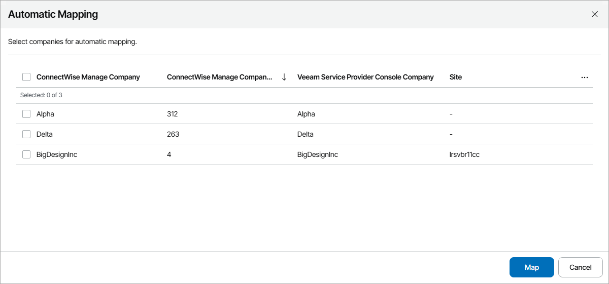
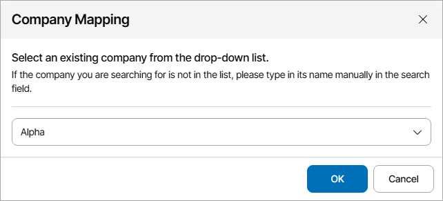

# Mapping Companies

To map companies in ConnectWise Manage to companies in Veeam Service Provider Console, you can use one of the following methods:

* [Map companies automatically](cwm_map_companies.md#auto)

Select this method if names of companies you manage in Veeam Service Provider Console are same or similar to their IDs in ConnectWise Manage.

* [Map companies manually](cwm_map_companies.md#manual)

Select this method if names of companies you manage in Veeam Service Provider Console and their IDs in ConnectWise Manage do not match.

Mapping Companies Automatically

To map companies automatically:

1. Log in to Veeam Service Provider Console.

For details, see [Accessing Veeam Service Provider Console](access_vac.md).

1. At the top right corner of the Veeam Service Provider Console window, click Configuration.
2. In the configuration menu on the left, click Catalog.
3. Click the ConnectWise Manage plugin tile.
4. In the menu on the left, click Companies.

Veeam Service Provider Console will display a list of all companies managed in ConnectWise Manage.

If you navigate the Companies tab for the first time, the Automatic Mapping window will pop up. In this window, click Review and proceed to step 7 of this procedure.

1. At the top of the list, click Map Companies Automatically.

This will automatically detect companies in ConnectWise Manage with the IDs same or similar to the names of companies configured in Veeam Service Provider Console.

1. In the displayed list of matched companies, select the necessary companies and click Map.

Mapping Companies Manually

To map companies manually:

1. Log in to Veeam Service Provider Console.

For details, see [Accessing Veeam Service Provider Console](access_vac.md).

1. At the top right corner of the Veeam Service Provider Console window, click Configuration.
2. In the configuration menu on the left, click Catalog.
3. Click the ConnectWise Manage plugin tile.
4. In the menu on the left, click Companies.

Veeam Service Provider Console will display the list of all companies managed in ConnectWise Manage.

1. From the list of companies, select an unmapped ConnectWise Manage company.

To narrow down the list of companies, you can apply the following filters:

* Company name — search companies by name configured in ConnectWise Manage.
* Type — limit the list of companies by type configured in ConnectWise Manage.

* Site — limit the list of companies by Veeam Cloud Connect server on which the company is registered.

* Status — limit the list of companies by mapping status (Mapped, Unmapped, Creating, Error).

1. At the top of the list, click Map to.
2. In the Company Mapping window, type the name of Veeam Service Provider Console company or reseller which you want to map.
3. Click OK.

1. Repeat steps 6–9 for all companies you want to map.

