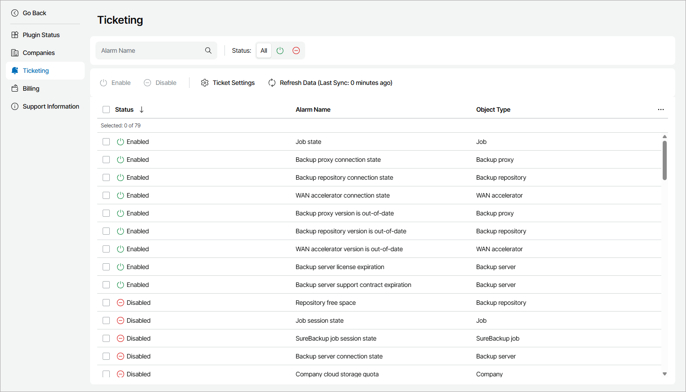

# Configuring Automated Ticketing

You can configure Veeam Service Provider Console to send information about triggered alarms to ConnectWise Manage and to create service tickets based on alarm data.

Prerequisites

Before configuring automated ticketing, check the following prerequisites:

* Configure ConnectWise Manage Plugin connection. For details, see [Configure Plugin Connection](cwm_connect_plugin.md).
* Enable the Companies, Configurations and Ticketing integration features. For details, see [Enable Integration Features](cwm_enable_features.md).
* Configure integration for the companies, for which you want to create tickets automatically. For details, see [Configuring Companies Integration](cwm_companies.md).
* In ConnectWise Manage, the service board on which you want to create tickets automatically must have the Default and Closed statuses configured. For details, see [ConnectWise Manage Documentation](https://docs.connectwise.com/ConnectWise_Documentation/090/020/170/100/010).

Configuring Automated Ticketing

To enable automatic creation of tickets based on Veeam Service Provider Console alarms:

1. Log in to Veeam Service Provider Console.

For details, see [Accessing Veeam Service Provider Console](access_vac.md).

1. At the top right corner of the Veeam Service Provider Console window, click Configuration.
2. In the configuration menu on the left, click Catalog.
3. Click the ConnectWise Manage plugin tile.
4. In the menu on the left, click Ticketing.

Veeam Service Provider Console will display a list of all enabled alarms, except alarms for the Cloud Gateway, Internal, Plugin, Site and User objects.

1. At the top of the page, click Ticket Settings and configure ticketing settings:

1. From the Service Board drop-down list, select a service board on which tickets will be created.
2. From the Delay Time drop-down list, select a time period after which the ticket for a triggered alarm must be created.
3. From the Warning Ticket Priority and Error Ticket Priority drop-down lists, select priority that must be assigned to tickets created for triggered Warning and Error alarms.

|  |
| --- |
| Note: |
| When you close a ticket in ConnectWise Manage, Veeam Service Provider Console resolves an alarm used to create this ticket. Conversely, when you resolve or acknowledge an alarm in Veeam Service Provider Console, the status of a ticket in ConnectWise Manage changes to Closed. The synchronization period for these actions is equal to the default synchronization interval for ticketing data. For details, see [Refreshing Data](cwm_refresh_data.md). |

1. From the list of alarms, select alarms for which you want to create tickets.
2. At the top of the list, click Enable.

Enabling Veeam Service Provider Console Notifications for Mapped Companies

If you have configured both ticket notification in ConnectWise Manage and alarm notification in Veeam Service Provider Console, your mapped companies can receive notifications on both triggered alarms from Veeam Service Provider Console and created tickets from ConnectWise Manage. By default, duplicated notifications are disabled in Veeam Service Provider Console plugin. If you want to send Veeam Service Provider Console alarm notifications to mapped company, you can enable notifications.

To enable Veeam Service Provider Console triggered alarm notifications for mapped companies:

1. Log in to Veeam Service Provider Console.

For details, see [Accessing Veeam Service Provider Console](access_vac.md).

1. At the top right corner of the Veeam Service Provider Console window, click Configuration.
2. In the configuration menu on the left, click Catalog.
3. Click the ConnectWise Manage plugin tile.
4. In the menu on the left, click Ticketing.

Veeam Service Provider Console will display a list of all enabled alarms, except alarms for the Cloud Gateway, Internal, Plugin, Site and User objects.

1. At the top of the page, click Ticket Settings.

Veeam Service Provider Console will open the Ticket Settings window.

1. Set the Send notifications to clients toggle to On.

After you enable Veeam Service Provider Console alarm notifications, Veeam Service Provider Console will enable all client alarms for mapped companies. Note that Veeam Service Provider Console will not enable internal alarms or alarms for mapped resellers.

