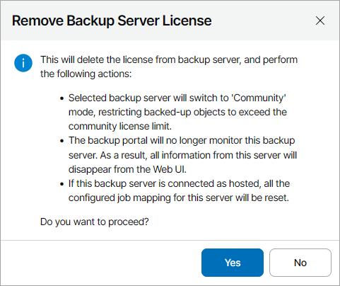

# Deleting Veeam Backup & Replication License

In Veeam Service Provider Console, you can delete license from managed Veeam Backup & Replication servers.

To delete a license from Veeam Backup & Replication servers:

1. Log in to Veeam Service Provider Console.

For details, see [Accessing Veeam Service Provider Console](access_vac.md).

1. At the top right corner of the Veeam Service Provider Console window, click Configuration.
2. In the menu on the left, click License Information.
3. On the Veeam Backup & Replication tab, select Veeam Backup & Replication servers from which you want to delete license.

To narrow down the list of Veeam Backup & Replication servers, you can apply the following filters:

* Reseller — search the list of Veeam Backup & Replication servers by name of a reseller who manages the server.
* Company — search the list of Veeam Backup & Replication servers by name of a company who owns the server.
* Hostname — search the list of Veeam Backup & Replication servers by the name of the server.
* License Status — limit the list of Veeam Backup & Replication servers by status of the installed license (Valid, Warning, Error).
* Type — limit the list of Veeam Backup & Replication servers by type of license installed on the server (Community, Rental, Subscription, Perpetual).
* Format — limit the list of Veeam Backup & Replication servers by format of a licensed unit (Instances, Sockets).

1. At the top of the list, click Delete.

Alternatively, you can right-click the necessary server and choose Delete.

1. In the Remove Backup Server License window, click Yes to confirm license deletion.

If Veeam Backup & Replication server has a merged license installed, select which part of the license you want to delete (Instance-based, Socket-based, All) and click Yes.

