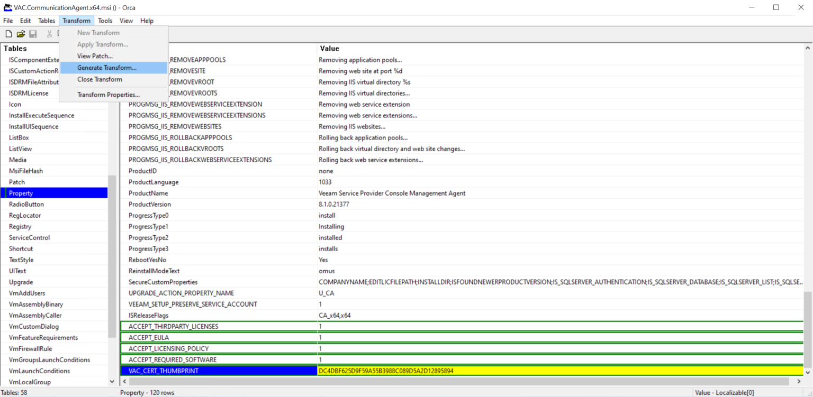

# How to Deploy Windows Management Agents with GPO

This topic describes how you can deploy the Veeam Service Provider Console management agent setup file to client computers using GPO.

You must create an MST file with custom configuration parameters and use this MST file to deploy the Veeam Service Provider Console management agents on client computers. The management agents will use parameters specified in the MST file to connect to a cloud gateway on the service provider side.

Step 1. Unpack Management Agent Setup Files

Unpack the content of the management agent setup file:

1. Obtain the necessary version of the Veeam Service Provider Console management agent setup file.

The management agent setup files reside in the C:\Program Files\Veeam\Availability Console\ApplicationServer\AgentPackage folder on the machine where Veeam Service Provider Console is installed. If you installed Veeam Service Provider Console using a distributed installation scenario, check this folder on a machine where the Veeam Service Provider Console Server component runs.

1. Perform installation of the management agent in the administrator mode to unpack the content of the setup file:

1. In the command prompt, run a command to start the Veeam Service Provider Console Communication Agent wizard.

For example, for the 64-bit version of the management agent, the command must be:

msiexec /a "<...>/VAC.CommunicationAgent.x64.msi"

1. At the Network Location step of the wizard, specify a directory to which setup files must be unpacked.
2. Click Install.

1. Check the output directory and make sure it includes the following items:

* Setup file VAC.CommunicationAgent.x<bit>.msi
* Folder RealProgramFiles

1. Copy the unpacked files to a network share.

The network share must be accessible from all client computers on which you want to deploy the management agent.

Make sure you set at least Read permissions on the files.

Step 2. Create MST Configuration File

Create an MST configuration file with installation parameters that point to the necessary cloud gateway:

1. In the directory with the setup file, open the management agent setup file for edit with Orca.

For details on Orca, see [Windows Dev Center](https://msdn.microsoft.com/en-us/library/windows/desktop/aa370557%28v%3Dvs.85%29.aspx).

1. In the menu, choose Transform > New Transform.
2. In the Tables pane, click Property.
3. Add the following properties to the table:

* ACCEPT\_THIRDPARTY\_LICENSES — specifies if you want to accept the terms of the license agreement for the 3rd party components.

Specify 1 if you want to accept the terms and proceed with installation.

* ACCEPT\_EULA — specifies if you want to accept the terms of the Veeam license agreement.

Specify 1 if you want to accept the terms and proceed with installation.

* ACCEPT\_LICENSING\_POLICY — specifies if you want to accept the terms of the Veeam licensing policy.

Specify 1 if you want to accept the terms and proceed with installation.

* ACCEPT\_REQUIRED\_SOFTWARE — specifies if you want to accept the terms of the required software license agreement.

Specify 1 if you want to accept the terms and proceed with installation.

* VAC\_CERT\_THUMBPRINT — thumbprint of a certificate that is installed on the Veeam Service Provider Console server, and used to secure traffic between the service provider and clients.

The thumbprint is used to verify the authenticity of the certificate. Although this property is optional, it is recommended that you specify it.

1. If you have changed the default port number when deploying the cloud gateway, locate the CC\_GATEWAY\_PORT property and change the port value.

For details on the gateway port configuration, see section [Adding Cloud Gateways](https://helpcenter.veeam.com/docs/backup/cloud/cloud_connect_gateway_server.html) of the Veeam Cloud Connect Guide.

1. In the menu, choose Transform > Generate Transform.
2. Save the MST file with configuration details.
3. Close Orca.
4. Copy the MST to a network share.

The network share must be accessible from all client computers on which you want to deploy the management agent.

Make sure you set at least Read permissions on the file.

Step 3. Create Group Policies

Create a Group Policy that will install and configure the management agent on client computers:

1. Log on to a domain controller.
2. Open the Group Policy Management Console.
3. Right-click the OU which includes computers on which management agents must be deployed, and choose to create a new Group Policy Object.
4. Right-click the Group Policy Object and choose Edit.
5. In the left pane of the Group Policy Management Editor, expand Computer Configuration > Policies > Software Settings.
6. Right-click Software Installation and select New > Package.
7. In the Open window, point to the management agent setup file located on the network share.
8. In the Deploy Software window, choose the Advanced deployment method.
9. Open the Modifications tab, click Add and choose the MST file located on the network share.
10. Click OK.
11. In the left pane of the Group Policy Management Editor, expand Computer Configuration > Policies > Administrative Templates > System > Logon.
12. Right-click the Always wait for the network at computer startup and logon policy setting and choose Edit.
13. In the policy setting window, select Enabled and click OK.
14. Close the Group Policy Management Editor.

Step 4. Apply Group Policies to Client Computers

Apply the created Group Policy to client computers.

