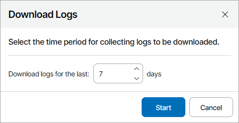

# Downloading Job Logs and Session Report

You can export a job session report and job logs for VM and file protection jobs configured on managed backup servers. Exported data is saved in a ZIP archive.

Downloading Job Logs and Session Report

To download a job session report and job logs:

1. Log in to Veeam Service Provider Console.

For details, see [Accessing Veeam Service Provider Console](access_vac.md).

1. In the menu on the left, click Backup Jobs.
2. Open the necessary tab:

* Virtual Machines > Virtual Infrastructure — select this tab to download logs for VM protection jobs (Backup, Replication, SureBackup, Backup copy, Backup to tape, VM copy, SQL database log backup, Oracle database log backup, PostgreSQL database log backup, Storage snapshot, CDP policy)
* Data Backup > Virtual Infrastructure — select this tab to download logs for file protection jobs (File share backup, File share backup copy, File copy, File to tape)
* Data Backup > Object Storage — select this tab to download logs for object storage jobs (Object storage data backup, Object storage data backup copy)

1. Select the necessary jobs in the list.
2. At the top of the jobs list, click Advanced > Download Logs.

Alternatively, you can right-click the necessary job, click Advanced > Download Logs.

1. In the Download Logs window, specify a number of days for which job statistics and logs must be collected.

1. Click Start.
2. Wait until Veeam Service Provider Console collects session and log data.

The file with exported data will be saved to the default download location on your computer.

