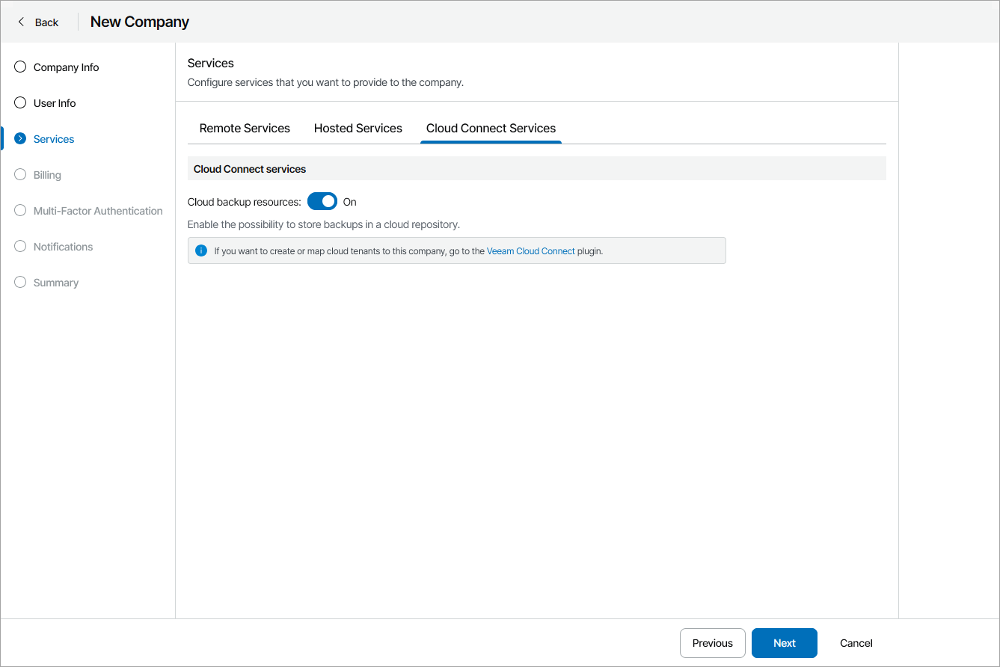

# Enable Cloud Services

On the Cloud Connect Services tab, set the Cloud backup resources toggle to Off if you do not want the company to use Veeam Cloud Connect resources.

To allocate Veeam Cloud Connect resources to the company, you must map cloud tenants with allocated cloud resources to the company. For details, see [Configuring Cloud Tenant Mapping](assign_cloud_tenants.md).

