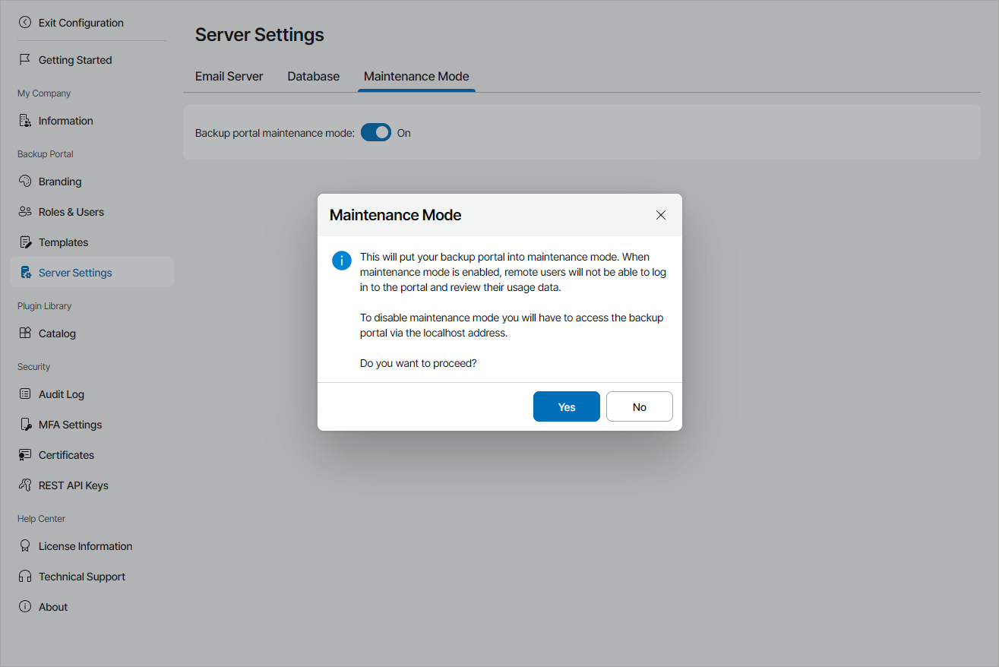

# Enabling and Disabling Maintenance Mode for Veeam Service Provider Console

When you perform crucial configuration changes to the Veeam Service Provider Console portal, you may need to put the portal into maintenance mode.

To notify the users about planned maintenance, you can configure [a custom message](#custom_mm_message).

Required Privileges

To perform this task, a user must have the following role assigned: Portal Administrator.

Enabling Maintenance Mode for Veeam Service Provider Console

When maintenance mode is enabled for the Veeam Service Provider Console portal, users will not be able to authenticate to the portal remotely. The portal welcome page will display a message saying that the portal is undergoing maintenance, and all services are temporarily unavailable.

|  |
| --- |
| Important! |
| If you installed Veeam Service Provider Console using the distributed deployment scenario, you will not be able to upgrade Veeam Service Provider Console Web UI component when maintenance mode is enabled. |

To enable maintenance mode for Veeam Service Provider Console:

1. Log in to Veeam Service Provider Console.

For details, see [Accessing Veeam Service Provider Console](access_vac.md).

1. At the top right corner of the Veeam Service Provider Console window, click Configuration.
2. In the configuration menu on the left, click Server Settings.
3. At the top, open the Maintenance Mode tab.
4. Set the Backup portal maintenance mode toggle to On.
5. In the Maintenance Mode window, click Yes.

Disabling Maintenance Mode for Veeam Service Provider Console

To disable maintenance mode for Veeam Service Provider Console:

1. Log on to the machine that hosts Veeam Service Provider Console as a local administrator.

If you installed Veeam Service Provider Console using the distributed deployment scenario, log on to the machine that hosts the Veeam Service Provider Console Web UI component.

1. Log in to Veeam Service Provider Console as a local administrator.

For details, see [Accessing Veeam Service Provider Console](access_vac.md).

Note that to disable maintenance mode, you must log in using local host address:

https://localhost:1280

1. In the Server Settings section, open the Maintenance Mode tab.
2. Set the Backup portal maintenance mode toggle to Off.

After you disable the maintenance mode for Veeam Service Provider Console, portal users will be able to authenticate to the portal in a usual way.

Configuring Planned Maintenance Warning

You can enable a pop-up message with custom text to inform users about planned maintenance. To do so:

1. Log in to Veeam Service Provider Console.

For details, see [Accessing Veeam Service Provider Console](access_vac.md).

1. At the top right corner of the Veeam Service Provider Console window, click Configuration.
2. In the configuration menu on the left, click Server Settings.
3. At the top, open the Maintenance Mode tab.
4. Set the Planned maintenance warning toggle to On.
5. Specify the message in the field.
6. Click Save.

Veeam Service Provider Console will display the message for every user upon login. If another pop-up message, such as the license usage report notification must be displayed at the same time, that message will take priority. In this case, the maintenance message will be displayed on the next login.

The maintenance message will repeat every 24 hours until you disable it. To disable the message, set the Planned maintenance warning toggle to Off.

