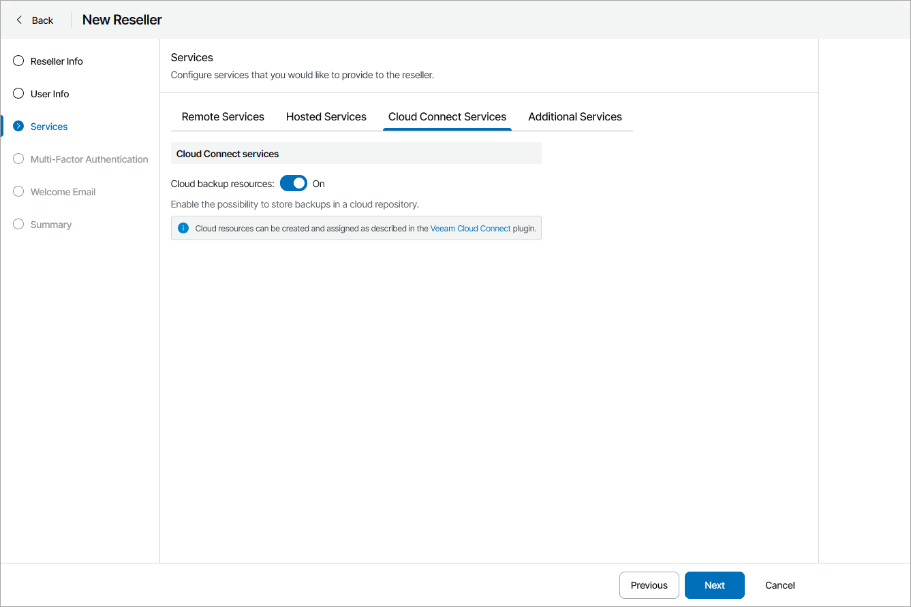

# Enable Cloud Services

On the Cloud Connect Services tab, set the Cloud backup resources toggle to Off if you do not want to allow reseller to use Veeam Cloud Connect resources.

To allocate Veeam Cloud Connect resources to the reseller, you must modify reseller cloud resources in the Veeam Service Provider Console plugin. For details, see [Modifying Reseller Cloud Resources](modify_reseller_cloud_resources.md).

