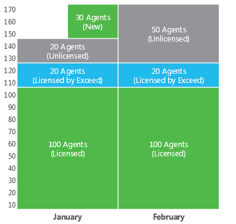

# Exceeding License Limit

In some situations, the number of actually managed Veeam backup agents may exceed the license limit. For example, this may happen when some Veeam backup agents are temporarily managed for testing or POC.

To deal with a situation when you need to manage more Veeam backup agents than covered by your license, Veeam Service Provider Console provides mechanisms of allowed increase limit and New Veeam backup agents.

Allowed Increase Limit

Veeam Service Provider Console allows you to manage more Veeam backup agents than covered by the number of instances or points specified in the license:

* Up to 20% for Rental licenses
* Up to 10% for Subscription licenses

If automatic license update is enabled and you have successfully submitted license usage report during the last 30 days, allowed increase limit will be doubled. After you disable automatic license update or stop submitting license usage reports once a month, allowed increase limit will return to default parameters.

When the number of Veeam backup agents registered in Veeam Service Provider Console exceeds the license limit, Veeam Service Provider Console treats them as follows:

* If the number of Veeam backup agents is within the allowed increase limit or less, Veeam Service Provider Console continues to manage all Veeam backup agents. To detect what Veeam backup agents must be managed, a FIFO (first-in first-out) queue is maintained: Veeam backup agents that are registered (activated) first are included first in the allowed exceed scope. The license status of Veeam backup agents within the increase limit is set to Licensed by exceed.

|  |
| --- |
| Note: |
| If a managed computer runs Veeam Backup & Replication, Veeam Backup Enterprise Manager, Veeam ONE or Veeam Backup for Microsoft 365 together with Veeam backup agent, Veeam Service Provider Console management agent will not be removed. |

* If the number of Veeam backup agents is above the allowed exceed limit, Veeam backup agents exceeding the licensed number plus the allowed increase limit are excluded from management. The license status of Veeam backup agents above the increase limit is set to Unlicensed status.

New Veeam Backup Agents

To provide more flexibility and introduce a trial period for Veeam backup agent management, Veeam Service Provider Console offers the concept of New Veeam backup agents. New Veeam backup agents are Veeam backup agents that were registered (activated) in Veeam Service Provider Console within the current calendar month. The mechanism of New Veeam backup agents is provided for Rental licenses (service providers) only.

New Veeam backup agents are managed in Veeam Service Provider Console as regular Veeam backup agents, but do not consume Veeam Service Provider Console licenses until the beginning of the new month. In license terms, New Veeam backup agents are counted separately from regular managed Veeam backup agents.

On the first day of the new month, the number of New Veeam backup agents introduced in the previous month is added to the number of regular managed Veeam backup agents. Veeam backup agents that were treated as New will be managed in Veeam Service Provider Console in the following cases:

* If there are enough Veeam Service Provider Console licenses to allocate to these Veeam backup agents.
* If there are no Veeam Service Provider Console licenses, but the grace period for the allowed increase is not yet over. In this case, Veeam backup agents will obtain the Licensed by exceed status.

Example

Consider the following example.

Your Rental license covers 100 Veeam backup agents and expires at the beginning of March.

At the beginning of January the number of Veeam backup agents is 140. Veeam Service Provider Console will manage 100 + 20 Veeam backup agents that were registered first (license limit + 20% allowed increase). 20 Veeam backup agents that were registered last will not be managed.

Consider the same example with New Veeam backup agents.

In the middle of January, 30 new Veeam backup agents are registered in Veeam Service Provider Console. Veeam Service Provider Console will manage these Veeam backup agents until the end of the month. If the license is not updated, and the instance pool is not increased, in February Veeam Service Provider Console will change the license statuses as follows:

* The license status of Veeam backup agents that exceeded the license limit in January will be kept as Licensed by Exceed.
* 30 Veeam backup agents that were registered in the middle of January will obtain the Unlicensed status.

If a new license covering a larger number of instances is installed, the licenses will be assigned to Veeam backup agents that were registered first.

Veeam Backup Agent License Statuses

In Veeam Service Provider Console, Veeam backup agent can have one of the following license statuses:

* Licensed (Activated) — Veeam backup agent has licenses assigned, and is fully managed by Veeam Service Provider Console.
* New — Veeam backup agent was registered (activated) within the current calendar month. Veeam backup agent is fully managed by Veeam Service Provider Console until the end of the current month.
* Unlicensed — Veeam backup agent does not have licenses assigned as there are no more licenses in the license pool. Unlicensed Veeam backup agent can have either the Licensed by Exceed status or Unlicensed status.

* Licensed by Exceed — Veeam backup agent has no licenses assigned, but is within the allowed increase limit.
* Unlicensed — Veeam backup agent has no licenses assigned, and cannot be managed in Veeam Service Provider Console.

