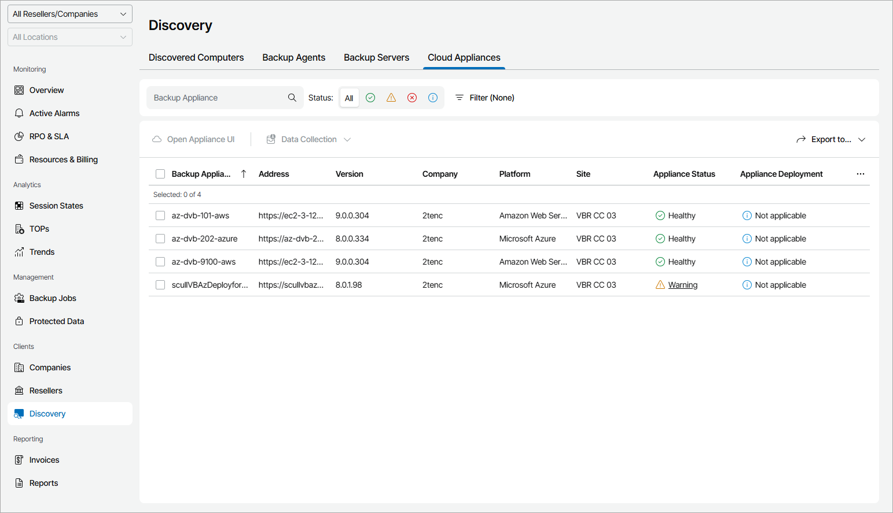

# Viewing and Exporting Cloud Backup Appliance Details

You can view details on Amazon Web Services, Microsoft Azure and Google Cloud appliances managed by Veeam Service Provider Console and Veeam Backup & Replication servers and export them to a CSV or XML file.

Required Privileges

To perform this task, a user must have one of the following roles assigned: Portal Administrator, Site Administrator, Portal Operator, Read-only User.

Viewing and Exporting Cloud Backup Appliance Details

To view and export appliance details:

1. Log in to Veeam Service Provider Console.

For details, see [Accessing Veeam Service Provider Console](access_vac.md).

1. In the menu on the left, click Discovery.
2. Open the Cloud Appliances tab.

Veeam Service Provider Console will display a list of all managed Amazon Web Services, Microsoft Azure and Google Cloud appliances.

To narrow down the list of appliances, you can apply the following filters:

* Backup Appliance — search the list of appliances by name.
* Status — search the list of appliances by status (Healthy, Warning, Error, Unknown).
* Platform — limit the list of appliances by platform (Amazon Web Services, Microsoft Azure, Google Cloud).
* Management type — limit the list of appliances by management type (Managed by console, Managed by backup server).

1. To export appliance details, click Export to and choose a format of the exported data:

* CSV — choose this option to structure exported data as a CSV file.
* XML — choose this option to structure exported data as an XML file.

The file with exported data will be saved to the default download location on your computer.

Each appliance in the list is described with a set of properties:

* Backup Appliance — name of a computer on which an appliance is deployed.
* Address — DNS name of an appliance.
* Version — appliance version.
* Company — name of a company to which the appliance belongs.

* Site — name of the Veeam Cloud Connect site on which the appliance is registered.

* Appliance Status — status of an appliance (Healthy, Warning, Error, Unknown).

You can click the Warning or Error link to view error details.

* Platform — appliance platform (Amazon Web Services, Microsoft Azure, Google Cloud).
* Remote UI Access — status of remote access to appliance web portal.
* Appliance Deployment — deployment status of the appliance security certificate.

You can click the status link to view appliance certificate details.

* Description — appliance description.

