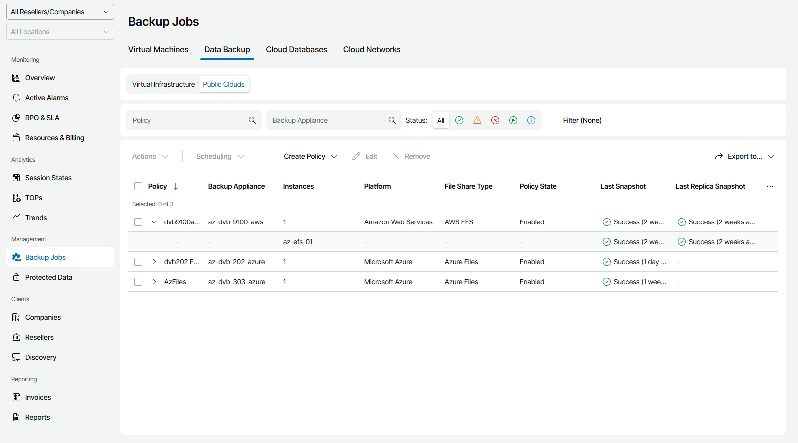

# File Shares

To view and export policy details for file shares in the public clouds:

1. Log in to Veeam Service Provider Console.

For details, see [Accessing Veeam Service Provider Console](access_vac.md).

1. In the menu on the left, click Backup Jobs.
2. Open the Data Backup tab and navigate to Public Clouds.

Veeam Service Provider Console will display a list of all policies configured to store file backups on external repositories integrated with managed backup servers.

To narrow down the list of policies, you can apply the following filters:

* Policy — search policies by name.

* Backup Appliance — search policies by appliance name.

* Status — limit the list of policies by the result of the latest session (Success, Warning, Failed, Running, Information).
* Type — limit the list of policies by type (Snapshot, Replica snapshot).
* Platform — limit the list of policies by cloud platform on which protected file shares reside (Amazon Web Services, Microsoft Azure).
* File share type — limit the list of policies by type of protected file share (AWS FSx, AWS EFS, Azure Files).
* Site/Reseller/Company/Location — limit the list of policies by Veeam Cloud Connect site, reseller, company and location to which policies belong. To limit the list of policies by site, reseller, company and location, use filters at the top left corner of the Veeam Service Provider Console window.

1. To export policy details, click Export to and choose a format of the exported data:

* CSV — choose this option to structure exported data as a CSV file.
* XML — choose this option to structure exported data as an XML file.

The file with exported data will be saved to the default download location on your computer.

Each policy in the list is described with a set of properties. By default, some properties in the list are hidden. To display additional properties, click the ellipsis on the right of the list header and choose job properties that must be displayed.

* Policy — policy name.

You can expand a policy to view detailed information on names and resource IDs of protected file shares.

* Instances — number of protected file shares.

To view names of protected file shares, expand the policy name.

* Backup Appliance — name of an appliance to which a policy belongs.

* Company — name of a company to which a policy belongs.
* Site — name of the Veeam Cloud Connect site on which the company is registered.
* Location — name of a location to which a policy belongs.

* Resource ID — ID of a cloud object.

To view IDs of protected objects, expand the policy name.

* Platform — name of a cloud platform on which a protected file share resides.
* File Share Type — type of a protected file share.
* Policy State — state of a policy schedule (Enabled, Disabled).
* Last Snapshot — status of the latest snapshot session and amount of time since the session completed.
* Last Replica Snapshot — status of the latest replication snapshot session and amount of time since the session completed.
* Next Run — date and time of the next scheduled policy run.
* Server Name — name of a backup server with which an external repository hosting backup files is integrated.
* Backup Target — name of a snapshot target location.
* Backup Copy Target — name of a replica snapshot target location.

