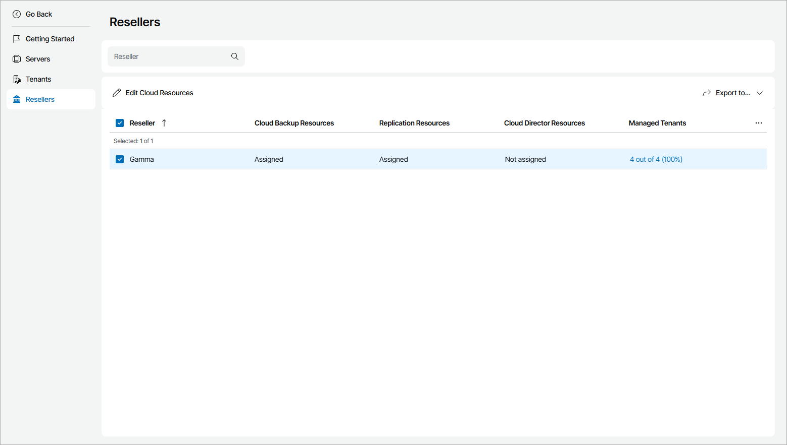

# Viewing and Exporting Reseller Details

You can view reseller details and export them to a CSV or XML file.

Viewing and Exporting Reseller Details

To view and export reseller details:

1. Log in to Veeam Service Provider Console.

For details, see [Accessing Veeam Service Provider Console](access_vac.md).

1. At the top right corner of the Veeam Service Provider Console window, click Configuration.
2. In the configuration menu on the left, click Catalog.
3. Click the Veeam Cloud Connect plugin tile.
4. In the menu on the left, click Resellers.

Veeam Service Provider Console will display a list of all registered reseller accounts with enabled cloud resources.

To find the necessary reseller, you can use the search field at the top of the list.

1. To export reseller details, click Export to and choose a format of the exported data:

* CSV — choose this option to structure exported data as a CSV file.
* XML — choose this option to structure exported data as an XML file.

The file with exported data will be saved to the default download location on your computer.

Each reseller in the list is described with a set of properties.

* Reseller — reseller name.
* Cloud Backup Resources — status of cloud backup resources (Assigned, Not assigned).
* Replication Resources — status of cloud backup resources (Assigned, Not assigned).
* Cloud Director Resources — status of VMware Cloud Director resources (Assigned, Not assigned).
* Managed Tenants — number of cloud tenants managed by a reseller.
* Cloud Backup Resource Usage — amount of cloud repository space consumed by reseller clients.
* Cloud Replica Type — type of replication enabled for reseller clients (Native, VMware Cloud Director).
* Hardware Plans Slots — number of reseller clients assigned to hardware plans.
* WAN Acceleration — indicates whether WAN acceleration is enabled for a reseller.

* Deleted Backup Recycle Bin — number of days for which backup files deleted from the company cloud repository must be stored in the recycle bin.

