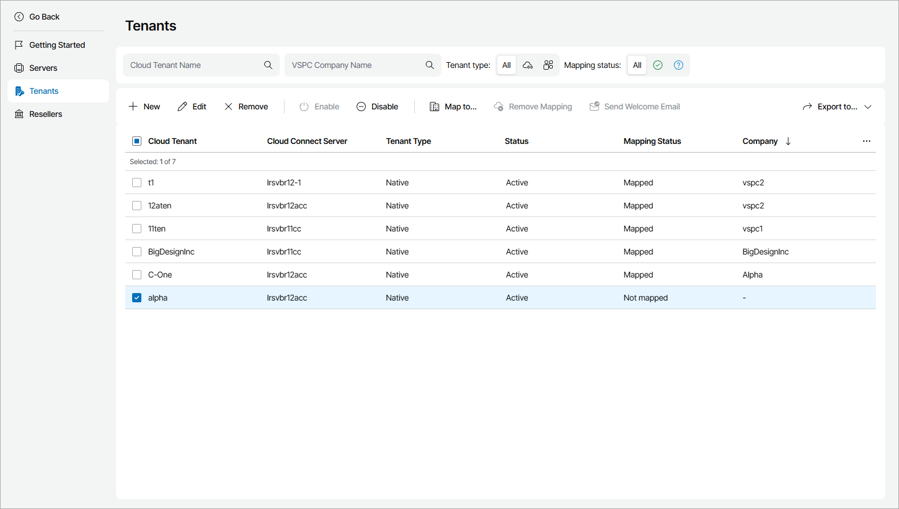

# Viewing and Exporting Cloud Tenant Details

You can view cloud tenant details and export them to a CSV or XML file.

Viewing and Exporting Cloud Tenant Details

To view and export cloud tenant details:

1. Log in to Veeam Service Provider Console.

For details, see [Accessing Veeam Service Provider Console](access_vac.md).

1. At the top right corner of the Veeam Service Provider Console window, click Configuration.
2. In the configuration menu on the left, click Catalog.
3. Click the Veeam Cloud Connect plugin tile.
4. In the menu on the left, click Tenants.

Veeam Service Provider Console will display a list of all registered cloud tenant accounts.

To narrow down the list of cloud tenants, you can apply the following filters:

* Cloud Tenant Name — search the list of cloud tenants by name.
* VSPC Company Name — search the list of cloud tenants by mapped VSPC company name.
* Tenant type — limit the list of cloud tenants by type (Native, Cloud Director).
* Mapping status — limit the list of cloud tenants by mapping status (Mapped, Not mapped).

1. To export cloud tenant details, click Export to and choose a format of the exported data:

* CSV — choose this option to structure exported data as a CSV file.
* XML — choose this option to structure exported data as an XML file.

The file with exported data will be saved to the default download location on your computer.

Each cloud tenant in the list is described with a set of properties.

* Cloud Tenant — cloud tenant name.
* Cloud Connect Server — name of a Veeam Cloud Connect site on which the cloud tenant is registered.
* Tenant Type — type of the cloud tenant (Native, VMware Cloud Director).
* Status — state of a cloud tenant account.
* Mapping Status — mapping status of a cloud tenant account.
* Company — name of a Veeam Service Provider Console company to which a cloud tenant is mapped.
* Cloud Repository Usage — the amount of cloud repository space used by the cloud tenant.
* Cloud Repository Usage Quota — the total amount of cloud repository space allocated to the cloud tenant.
* Cloud Repository Usage (%) — the amount of cloud repository space used by the cloud tenant out of total allocated space.
* Last Cloud Connect Activity Date — date and time of the latest cloud tenant account activity.
* Expiration Date — lease expiration date specified for a cloud tenant.
* Deleted Backup Recycle Bin — number of days for which backup files deleted from the cloud tenant repository must be stored in the recycle bin.

