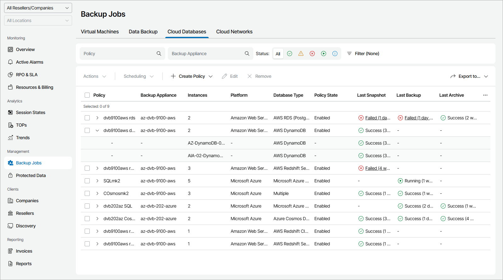

# Cloud Databases

To view and export policy details for databases in the public clouds:

1. Log in to Veeam Service Provider Console.

For details, see [Accessing Veeam Service Provider Console](access_vac.md).

1. In the menu on the left, click Backup Jobs.
2. Open the Cloud Databases tab.

Veeam Service Provider Console will display a list of all cloud backup policies.

To narrow down the list of policies, you can apply the following filters:

* Policy — search policies by name.
* Backup Appliance — search policies by appliance name.
* Status — limit the list of policies by the result of the latest session (Success, Warning, Failed, Running, Information).
* Type — limit the list of policies by type (Backup, Snaphot, Replica snapshot, Archive).
* Platform — limit the list of policies by cloud platform on which protected VMs reside (Amazon Web Services, Microsoft Azure, Google Cloud).
* Database type — limit the list of policies by type of protected database (AWS RDS, AWS DynamoDB, AWS Redshift Clusters, AWS Redshift Serverless, Microsoft Azure SQL, Azure Cosmos DB, Google Cloud Spanner, Google Cloud SQL).
* Site/Reseller/Company/Location — limit the list of policies by Veeam Cloud Connect site, reseller, company and location to which policies belong. To limit the list of policies by site, reseller, company and location, use filters at the top left corner of the Veeam Service Provider Console window.

1. To export policy details, click Export to and choose a format of the exported data:

* CSV — choose this option to structure exported data as a CSV file.
* XML — choose this option to structure exported data as an XML file.

The file with exported data will be saved to the default download location on your computer.

Each policy in the list is described with a set of properties. By default, some properties in the list are hidden. To display additional properties, click the ellipsis on the right of the list header and choose job properties that must be displayed.

* Policy — policy name.

You can expand a policy to view detailed information on names, resource IDs and types of protected databases.

* Instances — number of protected databases.

To view names of protected databases, expand the policy name.

* Backup Appliance — name of an appliance to which a policy belongs.

* Company — name of a company to which a policy belongs.
* Site — name of the Veeam Cloud Connect site on which the company is registered.
* Location — name of a location to which a policy belongs.

* Resource ID — ID of a cloud object.

To view IDs of protected databases, expand the policy name.

* Database Type — type and engine of a protected database.

If one policy protects several types of databases, the value in this column will not be displayed for collapsed policy.

To view types of protected databases, expand the policy name.

* Platform — name of a cloud platform on which a protected database reside.
* Policy State — state of a backup, snapshot or replication policy schedule (Enabled, Disabled).
* Last Snapshot — amount of time since the latest snapshot session completed and status of the session.
* Last Backup — amount of time since the latest backup session completed and status of the session.
* Last Replica Snapshot — amount of time since the latest replica snapshot session completed and status of the session.
* Last Archive — amount of time since the latest archive session completed and status of the session.
* Next Run — date and time of the next scheduled policy run.
* Server Name — name of a backup server with which an external repository hosting backup files is integrated.

