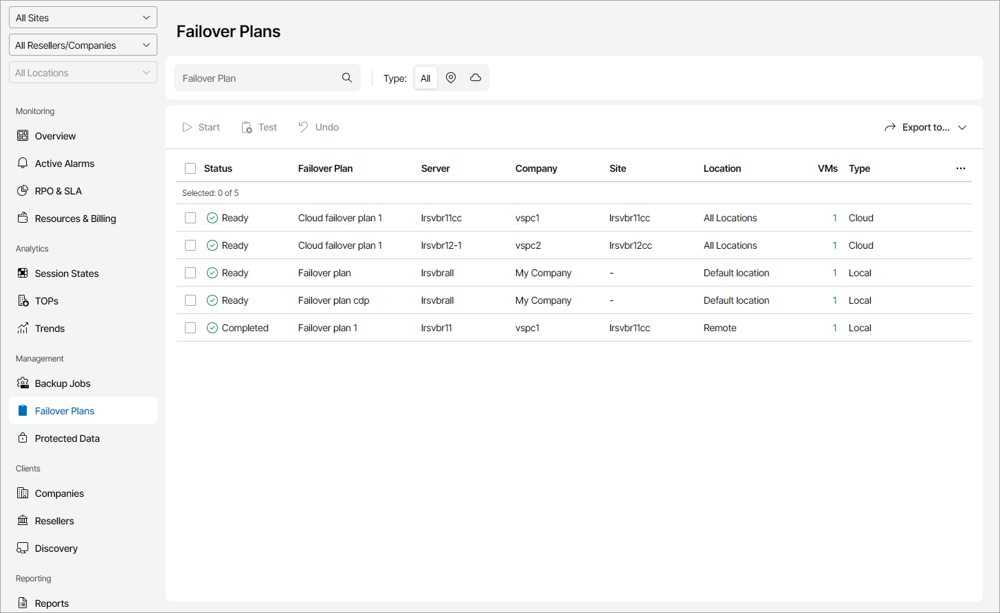

# Viewing and Exporting Failover Plan Details

You can view details on failover plans configured on managed backup servers and export them to a CSV or XML file.

Required Privileges

To perform this task, a user must have one of the following roles assigned: Portal Administrator, Site Administrator, Portal Operator, Read-only User.

Viewing and Exporting Failover Plan Details

To view and export failover plan details:

1. Log in to Veeam Service Provider Console.

For details, see [Accessing Veeam Service Provider Console](access_vac.md).

1. In the menu on the left, click Failover Plans.

Veeam Service Provider Console will display a list of all failover plans configured on managed backup servers.

To narrow down the list of failover plans, you can apply the following filters:

* Failover Plan — search failover plans by plan name.
* Type — limit the list of failover plans by type (Local, Cloud).

* Site/Reseller/Company/Location — limit the list of failover plans by Veeam Cloud Connect site, reseller, company and location to which failover plans belong. To limit the list of failover plans by site, reseller, company and location, use filters at the top left corner of the Veeam Service Provider Console window.

1. To export failover plan details, click Export to and choose a format for the exported data:

* CSV — choose this option to structure exported data as a CSV file.
* XML — choose this option to structure exported data as an XML file.

The file with exported data will be saved to the default download location on your computer.

Each failover plan in the list is described with a set of properties:

* Status — status of the failover plan (Ready, In Progress, Undo in Progress, Completed, Failed).
* Failover Plan — name of the failover plan.
* Server — name of a backup server on which the failover plan is configured.
* Company — name of the company for which the failover plan is configured.

* Site — name of the Veeam Cloud Connect site on which the company is registered.

* Location — name of the company location to which the failover plan belongs.
* VMs — number of VMs included in the failover plan.

To view the list of VMs in the plan, click the link in the VMs column.

* Type — type of the failover plan (Local, Cloud).

