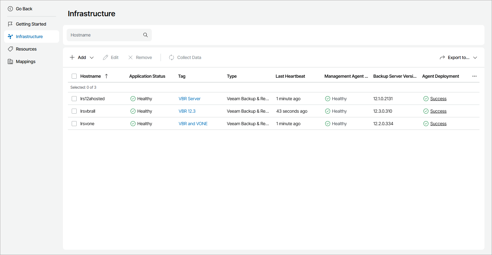

# Viewing and Exporting Hosted Veeam Backup & Replication Server Details

You can view details on hosted Veeam Backup & Replication and Veeam Backup Enterprise Manager servers and export them to a CSV or XML file:

1. Log in to Veeam Service Provider Console.

For details, see [Accessing Veeam Service Provider Console](access_vac.md).

1. At the top right corner of the Veeam Service Provider Console window, click Configuration.
2. In the configuration menu on the left, click Catalog.
3. Click the Veeam Backup & Replication plugin tile.
4. In the menu on the left, click Infrastructure.

Veeam Service Provider Console will display a list of all hosted Veeam Backup & Replication servers.

1. To export server details, click Export to and choose a format of the exported data:

* CSV — choose this option to structure exported data as a CSV file.
* XML — choose this option to structure exported data as an XML file.

The file with exported data will be saved to the default download location on your computer.

Each Veeam Backup & Replication server in the list is described with a set of properties.

* Backup Server — name of a computer on which Veeam Backup & Replication server is deployed.
* Application Status — status of the application running on a computer.

In some cases, after enabling multi-factor authentication for the Veeam Backup & Replication server, the value in this column may become Inaccessible. For details on how to resolve the issue, refer to [this Veeam KB article.](https://www.veeam.com/kb4431)

* Tag — tag assigned to a Veeam Backup & Replication server.

* Cluster Status — status of the High Availability cluster to which a Veeam Backup & Replication server belongs.

* Last Heartbeat — time period since a Veeam Service Provider Console management agent sent the latest heartbeat to Veeam Service Provider Console.
* Management Agent Status — Veeam Service Provider Console management agent status (Healthy, Warning, Error).

You can click the Error link to view error details.

* Backup Server Version — version of a Veeam Backup & Replication server and installed or available patch.
* Agent Deployment — status of the management agent deployment.

You can click a link in the Agent Deployment column to view session details of the installation procedure.

