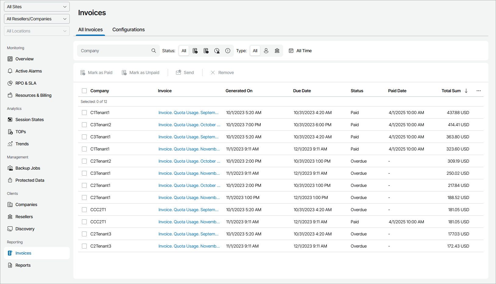

# Viewing and Downloading Invoice Details

Invoices that were generated manually or automatically, according to a specified schedule, are saved in the All Invoices list. Invoices are available as PDF documents that you can download to view their details.

Required Privileges

To perform this task, a user must have one of the following roles assigned: Portal Administrator, Site Administrator, Portal Operator, Read-only User.

Viewing and Downloading Invoice Details

To view invoice details:

1. Log in to Veeam Service Provider Console.

For details, see [Accessing Veeam Service Provider Console](access_vac.md).

1. In the menu on the left, click Invoices.

Veeam Service Provider Console will display a list of invoices. To narrow down the list of invoices, you can use the following filters:

* Company — search invoices by company for which invoices were generated.
* Status — limit the list of invoices by payment status (Paid, Unpaid, Overdue, Information).
* Type — limit the list of invoices by type (My, Reseller).
* Time period — limit the list of invoices by generation date.
* Site/Reseller/Company — limit the list of invoices by Veeam Cloud Connect site and company for which invoices were generated. To limit the list of invoices by site, reseller and company, use filters at the top left corner of the Veeam Service Provider Console window.

1. Select the necessary invoice in the list and click a link in the Invoice column.

The invoice PDF file will be saved to the default download location on your computer.

Information available in an invoice depends on the invoice type. For details on invoice types, see [Choosing Invoice Type](choose_invoice_type.md).

Each invoice in the list is described with a set of properties. By default, some properties in the list are hidden. To display additional properties, click the ellipsis on the right of the list header and choose properties that must be displayed.

* Company — name of a company for which an invoice was generated.

* Site — name of the Veeam Cloud Connect site on which the company is registered.
* Invoice — link to download an invoice.
* Generated On — date and time when an invoice was generated.
* Due Date — date by which a client company must make a payment.
* Status — invoice status.
* Paid Date — date when an invoice was marked as paid.
* Total Sum — total cost of consumed backup services calculated for an invoice.
* Invoice ID — number that uniquely identifies an invoice.
* Subscription Plan — name of a subscription plan which was used to charge a company in Veeam Service Provider Console.

