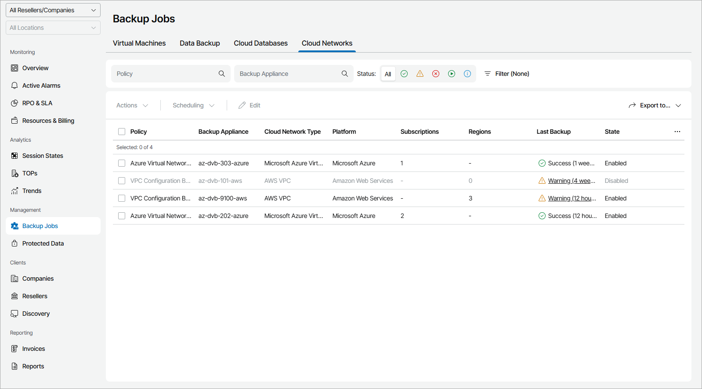

# Cloud Networks

To view and export policy details for virtual network configurations:

1. Log in to Veeam Service Provider Console.

For details, see [Accessing Veeam Service Provider Console](access_vac.md).

1. In the menu on the left, click Backup Jobs.
2. Open the Cloud Networks tab.

Veeam Service Provider Console will display a list of all cloud backup policies.

To narrow down the list of policies, you can apply the following filters:

* Policy — search policies by name.
* Backup Appliance — search policies by appliance name.
* Status — limit the list of policies by the result of the latest session (Success, Warning, Failed, Running, Information).
* Platform — limit the list of policies by cloud platform on which protected networks are configured (Amazon Web Services, Microsoft Azure).
* Site/Reseller/Company/Location — limit the list of policies by Veeam Cloud Connect site, reseller, company and location to which policies belong. To limit the list of policies by site, reseller, company and location, use filters at the top left corner of the Veeam Service Provider Console window.

1. To export policy details, click Export to and choose a format of the exported data:

* CSV — choose this option to structure exported data as a CSV file.
* XML — choose this option to structure exported data as an XML file.

The file with exported data will be saved to the default download location on your computer.

Each policy in the list is described with a set of properties. By default, some properties in the list are hidden. To display additional properties, click the ellipsis on the right of the list header and choose job properties that must be displayed.

* Policy — backup, snapshot or replica snapshot policy name.

* Backup Appliance — name of an appliance to which a policy belongs.

* Company — name of a company to which a policy belongs.

* Site — name of the Veeam Cloud Connect site on which the company is registered.
* Location — name of a location to which a policy belongs.

* Server Name — name of a backup server with which an external repository hosting backup files is integrated.

* Cloud Network Type — type of a protected virtual network.

* Platform — name of a cloud platform on which a protected virtual network is configured.
* Subscriptions — number of Microsoft Azure subscriptions in which cloud storage with backups are located.
* Regions — number of Amazon Web Services regions in which cloud storage with backups are located.
* Last Backup — status of the latest policy session.
* State — state of a policy schedule (Enabled, Disabled).

