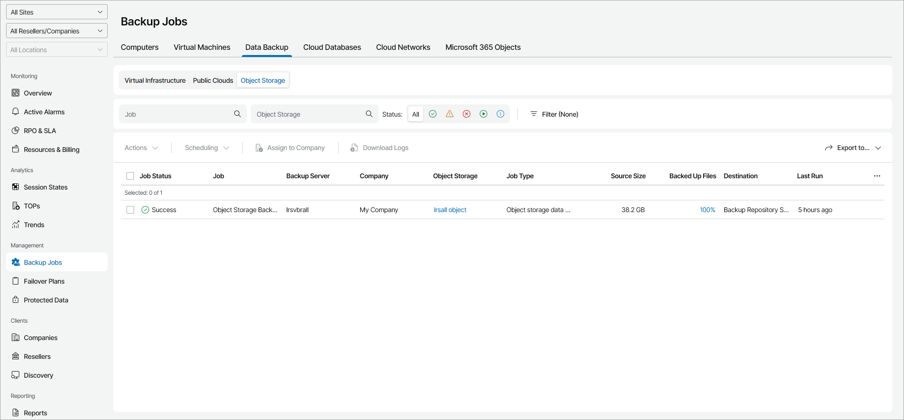

# Object Storage

To view and export object storage job details:

1. Log in to Veeam Service Provider Console.

For details, see [Accessing Veeam Service Provider Console](access_vac.md).

1. In the menu on the left, click Backup Jobs.
2. Open the Data Backup tab and navigate to Object Storage.

Veeam Service Provider Console will display a list of all data protection jobs configured on managed backup servers.

To narrow down the list of jobs, you can apply the following filters:

* Job — search jobs by job name.
* Object Storage — search jobs by name of an object storage repository.
* Status — limit the list of jobs by the result of the latest job session (Success, Warning, Failed, Running, Information).
* Type — limit the list of jobs by type (Object storage backup, Object storage backup copy).

* Site/Reseller/Company/Location — limit the list of jobs by Veeam Cloud Connect site, reseller, company and location to which jobs belong. To limit the list of jobs by site, reseller, company and location, use filters at the top left corner of the Veeam Service Provider Console window.

1. To export job details, click Export to and choose a format of the exported data:

* CSV — choose this option to structure exported data as a CSV file.
* XML — choose this option to structure exported data as an XML file.

The file with exported data will be saved to the default download location on your computer.

Each job in the list is described with a set of properties. By default, some properties in the list are hidden. To display additional properties, click the ellipsis on the right of the list header and choose job properties that must be displayed.

* Job Status — status of the latest job session (Success, Warning, Failed, Running, No Info).
* Job — name of a data protection job.
* Backup Server — name of a backup server on which a job is configured.
* Company — name of a company to which a job belongs.

* Site — name of the Veeam Cloud Connect site on which the company is registered.

* Location — name of a location to which a job belongs.
* Object Storage — name of an object storage repository. If a job protects multiple object storage, this column displays the number of storage included in the job.

You can click this property to view and export details of object storage included in a job. For details, see [Object Storage Details](#details).

* Job Type — type of a file protection job (Object storage backup, Object storage backup copy).
* Source Size — size of protected data at the source object storage.
* Backed Up Files — percentage of files on a source server protected by a job.

You can click this property to view and export details of object storage included in a job. For details, see [Object Storage Details](#details).

* Destination — name of a target backup location.
* Last Run — amount of time since the latest job session started.
* Archive Repository — name of a backup repository where long-term backups are stored.
* Duration — time taken to complete the latest job session.
* Avg. Duration — average time a job session takes to complete (total duration of job sessions for the previous month divided by the number of job sessions for the previous month).
* Processing Rate — rate at which data was processed during the latest job session.
* Transferred Data — total amount of data that was transferred to target during the latest job session.
* Schedule — type of schedule configured for the job (Daily, Monthly, Periodically, Continuously, Chained, Not scheduled, Disabled).
* Bottleneck — bottleneck in the process of transferring the data from source to target (Source, Proxy, Network, Target).

Object Storage Details

The following details are available for protected object storage:

* Status — status of the latest object storage job session.
* Object Storage — name of an object storage repository.
* Files & Folders — number of files and folders included in a job.

Click this property to see the names of backup up items and applied file masks.

* N. of Files — number of files protected on an object storage.
* Changed Files — number of files changed since the previous restore point was created for an object storage.
* Transferred Files — percentage of changed files, that were successfully transferred to target during the latest job session.
* Duration — time taken to complete the latest job session.

