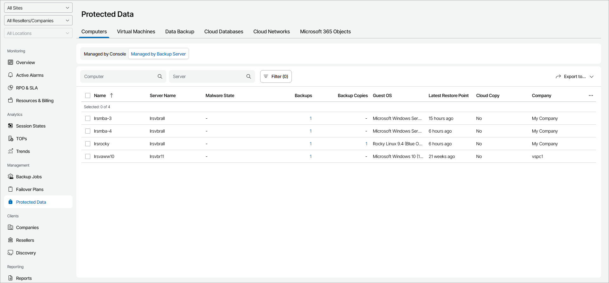

# Computers Protected by Veeam Backup & Replication

To view and export details of Veeam backup agents protected by Veeam Backup & Replication:

1. Log in to Veeam Service Provider Console as a Portal Administrator, Site Administrator, Portal Operator or Read-only User.

For details, see [Accessing Veeam Service Provider Console](access_vac.md).

1. In the menu on the left, click Protected Data.
2. Open the Computers tab and navigate to Managed by Backup Server.

Veeam Service Provider Console will display a list of all managed Veeam backup agents.

1. To narrow down the list of backup jobs, you can apply the following filters:

* Computer — search the list of computers by the name.
* Server — search the list of computers by the name of a backup server that manages Veeam backup agent.
* Operation mode — limit the list of computers by Veeam backup agent operation mode (Server, Workstation).
* Cloud copy — limit the list of computers by cloud copy existence (Yes, No).

* Malware state — limit the list of computers by restore point infection status (Clean, Infected, Suspicios, Unknown).

* Backup type — limit the list of computers by backup operation type (Entire computer, Volume-level, File-level).
* Guest OS — limit the list of protected computers by guest OS (Windows, Linux, macOS).

* Site/Reseller/Company/Location — limit the list of jobs by Veeam Cloud Connect site, reseller, company and location to which jobs belong. To limit the list of jobs by site, reseller, company and location, use filters at the top left corner of the Veeam Service Provider Console window.

1. To export protected computer details, click Export to and choose a format of the exported data:

* CSV — choose this option to structure exported data as a CSV file.
* XML — choose this option to structure exported data as an XML file.

The file with exported data will be saved to the default download location on your computer.

Each protected computer in the list is described with a set of properties. By default, some properties in the list are hidden. To display additional properties, click the ellipsis on the right of the list header and choose job properties that must be displayed.

* Name — name of a protected computer.
* Server Name — name of a backup server that manages Veeam backup agent.

* Malware State — antivirus scan result of the created restore points.

Note that to view the antivirus scan result, you must configure integration with the Veeam ONE server that monitors the backup server. For details, see [Integration with Veeam ONE](integration_one.md).

* Backups — number of backup jobs configured for a computer.

You can click this property, to view and export backup job details. For details, see [Veeam Backup Agent Job Details](#backup).

* Backup Copies — number of backup copy jobs configured for a computer.

You can click this property, to view and export backup copy job details. For details, see [Veeam Backup Agent Job Details](#backup).

* Guest OS — type of computer operation system (Linux, Windows, macOS).

* Latest Restore Point — amount of time since the latest restore point was created for a protected computer.

* Cloud Copy — indicates if the cloud copy exists for a protected computer.
* Company — name of a company to which a monitored computer belongs.

* Site — name of the Veeam Cloud Connect site on which the company is registered.

* Location — name of a location to which a monitored computer belongs.
* Operation Mode — Veeam backup agent operation mode (Workstation, Server).

Veeam Backup Agent Job Details

You can view and export the following details on Veeam backup agent jobs:

* Job Name — name of a data protection job.
* (For backup jobs) Operation Mode — Veeam backup agent job operation mode (Server, Workstation).
* (For backup jobs) Backup Type — backup operation type (Entire computer, Volume level, File level).

* Malware State — antivirus scan result of the created restore points.

Note that to view the antivirus scan result, you must configure integration with the Veeam ONE server that monitors the backup server. For details, see [Integration with Veeam ONE](integration_one.md).

* Restore Points — number of restore points available in the backup chain for a computer.

You can click this property to view details of each restore point. For details, see [Restore Point Details](#restore_point).

* Latest Restore Point — amount of time since the latest restore point was created for a protected computer.
* Backup Size — total size of all restore points created by a job.
* Destination — target backup location.
* Next Run — date and time of the next scheduled job run.

Restore Point Details

You can view the following details on backed up data:

* Date — date of restore point creation.
* Source Size — size of the source data backed up.

* Malware State — antivirus scan result of the restore point.

Note that to view the antivirus scan result, you must configure integration with the Veeam ONE server that monitors the backup server. For details, see [Integration with Veeam ONE](integration_one.md).

* Backed Up Data — size of the data included in the backup increment.
* Restore Point Size — size of the restore point.

You can export restore points details. To do this, click Export to and choose a format of the exported data:

* CSV — choose this option to structure exported data as a CSV file.
* XML — choose this option to structure exported data as an XML file.

The file with exported data will be saved to the default download location on your computer.

