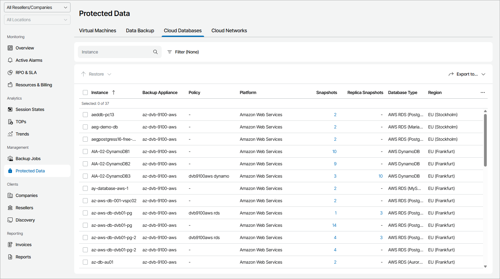

# Cloud Databases

To view and export protected cloud databases details:

1. Log in to Veeam Service Provider Console.

For details, see [Accessing Veeam Service Provider Console](access_vac.md).

1. In the menu on the left, click Protected Data.
2. Open the Cloud Databases tab.

Veeam Service Provider Console will display a list of all cloud databases protected by Veeam Backup for Public Clouds.

To narrow down the list of databases, you can apply the following filters:

* Instance — search databases by instance name.
* Type — limit the list of databases by protection policy type (Backup, Snapshot, Replica snapshot, Archive).
* Platform — limit the list of databases by type of platform on which databases reside (Amazon Web Services, Microsoft Azure, Google Cloud).

* Database type — limit the list of policies by type of protected database (AWS RDS, AWS DynamoDB, AWS Redshift Clusters, AWS Redshift Serverless, Microsoft Azure SQL, Azure Cosmos DB, Google Cloud Spanner, Google Cloud SQL).

* Site/Reseller/Company/Location — limit the list of databases by Veeam Cloud Connect site, reseller, company and location to which jobs belong. To limit the list of jobs by site, reseller, company and location, use filters at the top left corner of the Veeam Service Provider Console window.

1. To export job details, click Export to and choose a format of the exported data:

* CSV — choose this option to structure exported data as a CSV file.
* XML — choose this option to structure exported data as an XML file.

The file with exported data will be saved to the default download location on your computer.

Each cloud database in the list is described with a set of properties:

* Instance — name of a protected database instance.

* Backup Appliance — name of an appliance to which a policy belongs.

* Company — name of a company to which a database belongs.
* Site — name of the Veeam Cloud Connect site on which the company is registered.
* Location — name of a location to which a database belongs.
* Policy — policy name.
* Platform — platform on which a database resides.
* Backups — number of backup restore points configured for a database.

You can click this property, to view and export restore point details. For details, see [Restore Point Details](#restore_point).

* Last Backup — amount of time since the latest backup session completed.
* Archives — number of archive restore points configured for a database.

You can click this property, to view and export restore point details. For details, see [Restore Point Details](#restore_point).

* Last Archive — amount of time since the latest archive backup session completed.
* Snapshots — number of snapshots available in the backup chain for a database.

You can click this property, to view and export restore point details. For details, see [Restore Point Details](#restore_point).

* Last Snapshot — amount of time since the latest backup policy session completed.
* Replica Snapshots — number of replica snapshots available in the backup chain for a database.

You can click this property, to view and export restore point details. For details, see [Restore Point Details](#restore_point).

* Last Replica Snapshot — amount of time since the latest replica snapshot was created.
* Database Type — type and engine of protected database.
* Total Size — total size of the source data backed up.
* Region — name of region in which cloud storage with backups is located.

* Resource ID — ID of a cloud object.

* Last Health Check — status of the latest backup health check session and amount of time since the latest health check session.

Restore Point Details

You can view the following details on backed up data:

* Date — date of restore point creation.
* Type — restore point type.
* Restore Point Region — name of region in which restore point is located.

You can export restore points details. To do this, click Export to and choose a format of the exported data:

* CSV — choose this option to structure exported data as a CSV file.
* XML — choose this option to structure exported data as an XML file.

The file with exported data will be saved to the default download location on your computer.

