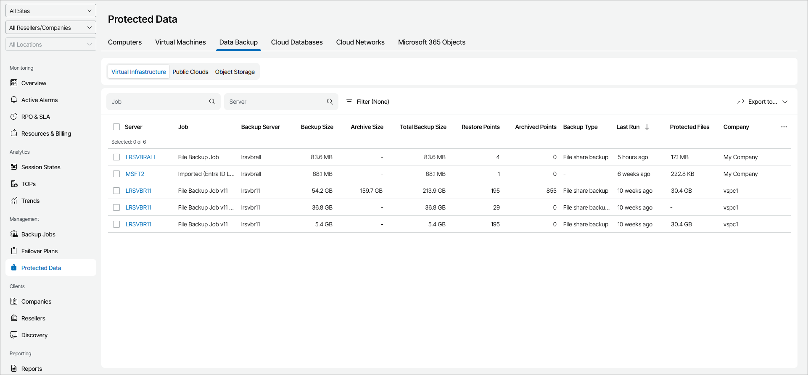

# File Shares

To view and export protected file share details:

1. Log in to Veeam Service Provider Console.

For details, see [Accessing Veeam Service Provider Console](access_vac.md).

1. In the menu on the left, click Protected Data.
2. Open the Data Backup tab and navigate to Virtual Infrastructure.

Veeam Service Provider Console will display a list of all file share servers protected by Veeam Backup & Replication.

To narrow down the list of file shares, you can apply the following filters:

* Job — search file shares by job name.
* Server — search file shares by file share server name.
* Backup Type — limit the list of file shares by backup type (File share backup, File share backup copy, Imported file backup).

* Site/Reseller/Company/Location — limit the list of file shares by Veeam Cloud Connect site, reseller, company and location to which file shares belong. To limit the list of file shares by site, reseller, company and location, use filters at the top left corner of the Veeam Service Provider Console window.

1. To export protected file share details, click Export to and choose a format of the exported data:

* CSV — choose this option to structure exported data as a CSV file.
* XML — choose this option to structure exported data as an XML file.

The file with exported data will be saved to the default download location on your computer.

Each file share in the list is described with a set of properties. By default, some properties in the list are hidden. To display additional properties, click the ellipsis on the right of the list header and choose job properties that must be displayed.

* Server — name of a file share server.

You can click this property to view the list of backed up items and applied masks.

* Job — name of a data protection job.
* Backup Server — name of a backup server on which backup was created.
* Backup Size — size of files stored in backup repository.
* Archive Size — size of files stored in archive repository.
* Total Backup Size — total size of backup files in backup and archive repositories.
* Backup Repository — name of a backup repository on which backups are stored.
* Restore Points — number of restore points available in the backup repository.
* Archived Points — number of restore points available in the archive repository.
* Last Run — indicates how long ago the file share restore point was created.
* Protected Files — size of protected data at the source file share.

* Site — name of the Veeam Cloud Connect site on which the company is registered.

* Company — name of a company to which a file share server belongs.
* Location — name of a location to which a file share server belongs.
* Archive Repository — name of an archive repository.

