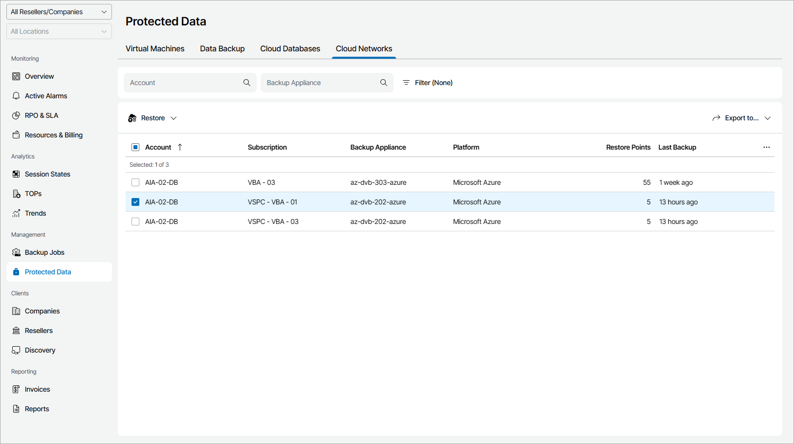

# Cloud Networks

To view and export protected virtual network configurations details:

1. Log in to Veeam Service Provider Console.

For details, see [Accessing Veeam Service Provider Console](access_vac.md).

1. In the menu on the left, click Protected Data.
2. Open the Cloud Network tab.

Veeam Service Provider Console will display a list of all virtual network configurations protected by Veeam Backup for Public Clouds.

To narrow down the list of networks, you can apply the following filters:

* Account — search networks by account name.

* Backup Appliance — search networks by appliance name.

* Platform — limit the list of networks by type of platform on which protected networks are configured (Amazon Web Services, Microsoft Azure).

* Site/Reseller/Company/Location — limit the list of networks by Veeam Cloud Connect site, reseller, company and location to which jobs belong. To limit the list of jobs by site, reseller, company and location, use filters at the top left corner of the Veeam Service Provider Console window.

1. To export job details, click Export to and choose a format of the exported data:

* CSV — choose this option to structure exported data as a CSV file.
* XML — choose this option to structure exported data as an XML file.

The file with exported data will be saved to the default download location on your computer.

Each virtual network configuration in the list is described with a set of properties:

* Account — name of a protected Amazon Web Services account.

* Site — name of the Veeam Cloud Connect site on which the company is registered.
* Company — name of a company to which a network configuration belongs.
* Location — name of a location to which a network configuration belongs.

* Subscription — name of an Microsoft Azure subscription in which cloud storage with backups is located.
* Region — name of an Amazon Web Services region in which cloud storage with backups is located.
* Backup Appliance — name of an appliance to which a policy belongs.
* Platform — platform on which a virtual network is configured.
* Restore Points — number of restore points configured for a virtual network.
* Last Backup — amount of time since the latest backup session completed.

