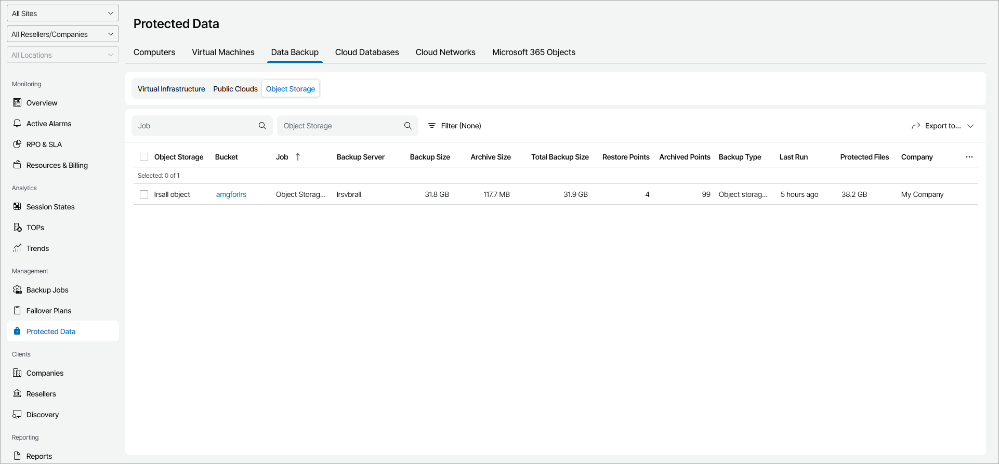

# Object Storage

To view and export protected object storage details:

1. Log in to Veeam Service Provider Console.

For details, see [Accessing Veeam Service Provider Console](access_vac.md).

1. In the menu on the left, click Protected Data.
2. Open the Data Backup tab and navigate to Object Storage.

Veeam Service Provider Console will display a list of all object storage repositories protected by Veeam Backup & Replication.

To narrow down the list of object storage, you can apply the following filters:

* Job — search object storage by job name.
* Object Storage — search object storage by object storage repository name.
* Backup Type — limit the list of object storage by backup type (Object storage backup, Object storage backup copy).

* Site/Reseller/Company/Location — limit the list of object storage by Veeam Cloud Connect site, reseller, company and location to which object storage belong. To limit the list of object storage by site, reseller, company and location, use filters at the top left corner of the Veeam Service Provider Console window.

1. To export protected object storage details, click Export to and choose a format of the exported data:

* CSV — choose this option to structure exported data as a CSV file.
* XML — choose this option to structure exported data as an XML file.

The file with exported data will be saved to the default download location on your computer.

Each object storage in the list is described with a set of properties. By default, some properties in the list are hidden. To display additional properties, click the ellipsis on the right of the list header and choose job properties that must be displayed.

* Object Storage — name of an object storage repository.
* Bucket — Amazon S3 bucket or Microsoft Azure container that is used as a backup target.

You can click this property to view the list of backed up items and applied masks.

* Job — name of a data protection job.
* Backup Server — name of a backup server on which backup was created.
* Backup Size — size of files stored in backup repository.
* Archive Size — size of files stored in archive repository.
* Total Backup Size — total size of backup files in backup and archive repositories.
* Backup Repository — name of a backup repository on which backups are stored.
* Restore Points — number of restore points available in the backup repository.
* Archived Points — number of restore points available in the archive repository.
* Backup Type — type of the created backup (Object storage backup, Object storage backup copy).
* Last Run — indicates how long ago the object storage restore point was created.
* Protected Files — size of protected data at the source object storage.

* Site — name of the Veeam Cloud Connect site on which the company is registered.

* Company — name of a company to which an object storage server belongs.
* Location — name of a location to which an object storage server belongs.
* Archive Repository — name of an archive repository.

