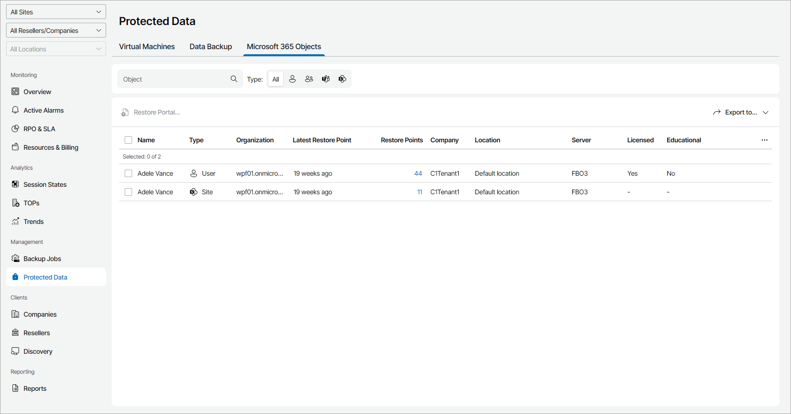

# Viewing and Exporting Protected Object Details

To view and export protected Veeam Backup for Microsoft 365 objects details:

1. Log in to Veeam Service Provider Console.

For details, see [Accessing Veeam Service Provider Console](access_vac.md).

1. In the menu on the left, click Protected Data.
2. Open the Microsoft 365 Objects tab.

Veeam Service Provider Console will display a list of all objects protected by managed Veeam Backup for Microsoft 365.

To narrow down the list of objects, you can apply the following filters:

* Object — search objects by name.
* Type — limit the list of objects by type (User, Group, Teams, Site).
* Site/Reseller/Company/Location — limit the list of objects by Veeam Cloud Connect site, reseller, company and location to which jobs belong. To limit the list of jobs by site, reseller, company and location, use filters at the top left corner of the Veeam Service Provider Console window.

The Site filter is available only if you have connected more than one Veeam Cloud Connect server to Veeam Service Provider Console.

1. To export job details, click Export to and choose a format of the exported data:

* CSV — choose this option to structure exported data as a CSV file.
* XML — choose this option to structure exported data as an XML file.

The file with exported data will be saved to the default download location on your computer.

Each object in the list is described with a set of properties:

* Name — name of a protected object.
* Type — type of a protected object.
* Organization — name of a Microsoft 365 organization.
* Latest Restore Point — amount of time since the latest restore point was created for a protected object.
* Backup Copies — number of backup copy restore points available in the backup chain for an object.

You can click this property to view details of each restore point. For details, see [Restore Point Details](#restore_point).

* Restore Points — number of restore points available in the backup chain for an object.

You can click this property to view details of each restore point. For details, see [Restore Point Details](#restore_point).

* Company — name of a company to which an object belongs.
* Site — name of the Veeam Cloud Connect site on which the company is registered.
* Location — name of a location to which an object belongs.
* Server — name of the Veeam Backup for Microsoft 365 server to which an object belongs.
* Licensed — indicates whether protected object consumes Veeam Backup for Microsoft 365 license.
* Educational — indicates whether protected user has a Microsoft 365 Education license.

If the protected object has a User type, the missing value (—) indicates that the user was backed up by Veeam Backup for Microsoft 365 version 7a or earlier.

Restore Point Details

You can view the following details on created restore points:

* Date — date and time when the restore point was created.
* Processing Options — processing options specified for the restore point.
* Target Repository — name of a target backup repository.

You can export restore points details. To do this, click Export to and choose a format of the exported data:

* CSV — choose this option to structure exported data as a CSV file.
* XML — choose this option to structure exported data as an XML file.

The file with exported data will be saved to the default download location on your computer.

