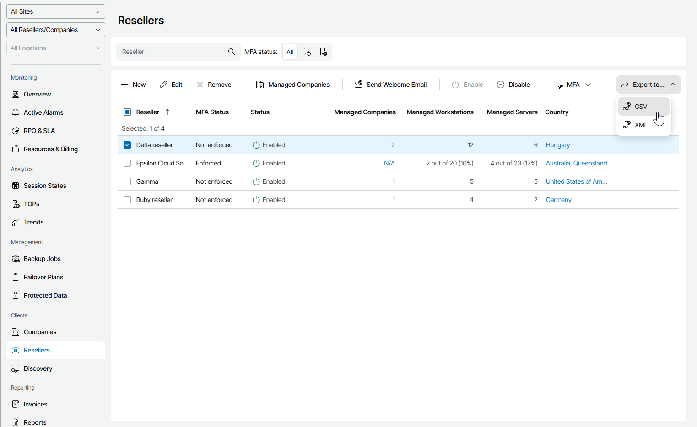

# Viewing and Exporting Reseller Details

You can view reseller details and export them to a CSV or XML file.

Required Privileges

To perform this task, a user must have the following role assigned: Portal Administrator.

Viewing and Exporting Reseller Details

To view and export reseller details:

1. Log in to Veeam Service Provider Console.

For details, see [Accessing Veeam Service Provider Console](access_vac.md).

1. In the menu on the left, click Resellers.

Veeam Service Provider Console will display a list of all registered reseller accounts.

To find the necessary reseller, you can use the search field at the top of the list.

1. To export reseller details, click Export to and choose a format of the exported data:

* CSV — choose this option to structure exported data as a CSV file.
* XML — choose this option to structure exported data as an XML file.

The file with exported data will be saved to the default download location on your computer.

Each reseller in the list is described with a set of properties.

* Reseller — reseller name.
* MFA Status — indicates whether multi-factor authentication is enforced for reseller users.
* Used Points — number of points consumed by reseller clients.
* Status — status of a reseller account (Enabled, Disabled).
* Managed Companies — number of companies managed by a reseller.
* Managed Workstations — number of Workstation Veeam backup agents managed by a reseller.
* Managed Servers — number of Server Veeam backup agents managed by a reseller.

* Managed Workstations (Backup Server) — number of Veeam backup agents in the Workstation mode managed on the Veeam Backup & Replication servers of companies managed by a reseller.
* Managed Servers (Backup Server) — number of Veeam backup agents in the Server mode managed on the Veeam Backup & Replication servers of companies managed by a reseller.

* Country — country and region where the reseller is registered.

* Microsoft 365 Backup Servers — number of Veeam Backup for Microsoft 365 servers assigned to a reseller.

