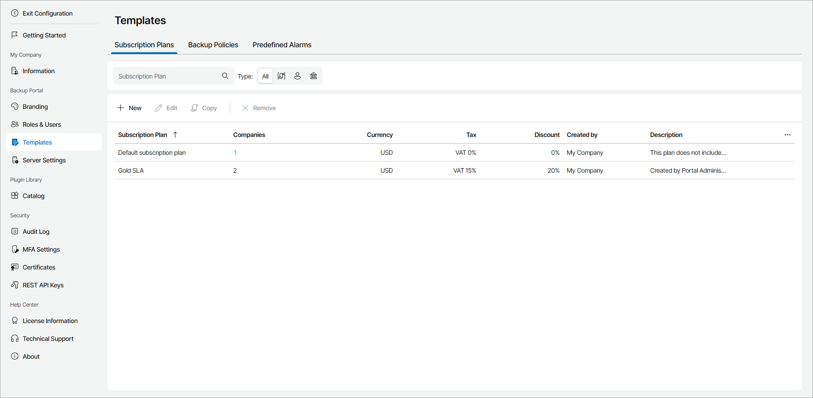

# Viewing Subscription Plan Details

You can view details on subscription plans.

Required Privileges

To perform this task, a user must have one of the following roles assigned: Portal Administrator, Site Administrator.

Viewing Subscription Plan Details

To view subscription plan details:

1. Log in to Veeam Service Provider Console.

For details, see [Accessing Veeam Service Provider Console](access_vac.md).

1. At the top right corner of the Veeam Service Provider Console window, click Configuration.
2. In the configuration menu on the left, click Templates and navigate to the Subscription Plans tab.
3. To narrow down the list of subscription plans, you can apply the following filters:

* Subscription Plan — search subscription plans by plan name.
* Type — limit the list of subscription plans by creation type (Predefined, My Plans, Reseller).

Each subscription plan in the list is described with a set of properties. By default, some properties in the list are hidden. To display additional properties, click the ellipsis on the right of the list header and choose properties that must be displayed.

* Subscription Plan — name of a subscription plan.
* Companies — number of companies to which a plan is assigned.

You can click this property to view the detailed list of companies.

* Currency — currency chosen for a subscription plan.
* Tax — tax type specified for a subscription plan and tax rate amount, in percent.
* Discount — discount rate specified for a subscription plan.
* Created By — name of a company whose user created a subscription plan.
* Description — description of a subscription plan.

