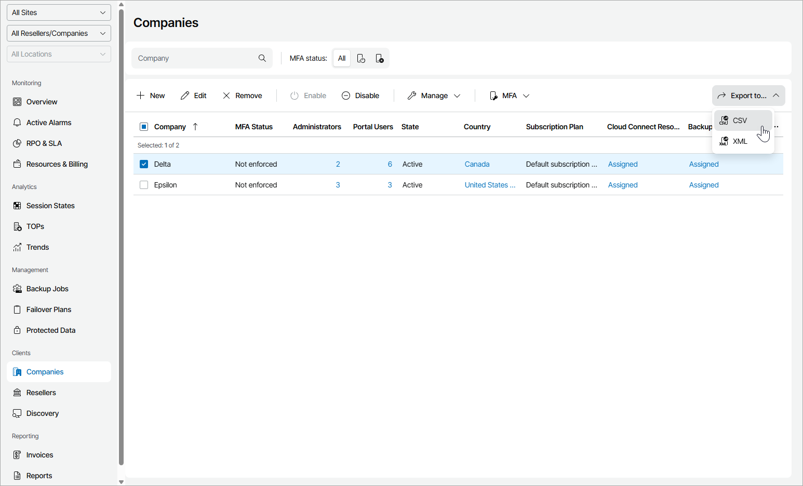

# Viewing and Exporting Company Details

You can view company details and export them to a CSV or XML file.

Required Privileges

To perform this task, a user must have one of the following roles assigned: Portal Administrator, Site Administrator, Portal Operator, Read-only User.

Viewing and Exporting Company Details

To view and export company details:

1. Log in to Veeam Service Provider Console.

For details, see [Accessing Veeam Service Provider Console](access_vac.md).

1. In the menu on the left, click Companies.

Veeam Service Provider Console will display a list of all registered company accounts.

To find the necessary company, you can use the search field at the top of the list.

1. To export company details, click Export to and choose a format of the exported data:

* CSV — choose this option to structure exported data as a CSV file.
* XML — choose this option to structure exported data as an XML file.

The file with exported data will be saved to the default download location on your computer.

Each company in the list is described with a set of properties.

* Company — company name.
* MFA Status — indicates whether multi-factor authentication is enforced for company users.
* Locations — number of company locations.
* Administrators — number of company users with the Company Owner, Company Administrator or Location Administrator role assigned.
* Portal Users — number of company users with the Location User, Subtenant or Company Invoice Auditor role assigned.
* State — state of a company account.
* Backup Policies — number of backup policies assigned to Veeam backup agents managed for a company.
* Country — country and region where the company is registered.
* Subscription Plan — subscription plan assigned to a company.
* Managed Workstations — number of Veeam backup agents in the Workstation mode managed for the company.
* Managed Servers — number of Veeam backup agents in the Server mode managed for the company.
* Managed Workstations (Backup Server) — number of Veeam backup agents in the Workstation mode managed on the company Veeam Backup & Replication server.
* Managed Servers (Backup Server) — number of Veeam backup agents in the Server mode managed on the company Veeam Backup & Replication server.
* Creation Date — date and time when the company was created.
* Cloud Connect Resources — status of company Veeam Cloud Connect resources.

You can click the Details link to view details on resources assigned to the company.

* Backup Resources — status of company Veeam Backup & Replication, Veeam Backup for Microsoft 365 and Veeam Backup for Public Clouds resources.

You can click the Details link to view details on resources assigned to the company.

