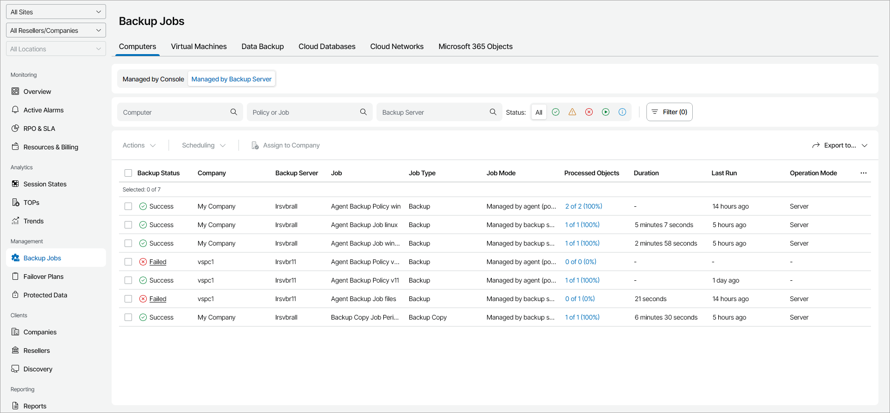

# Computers Protected by Veeam Backup & Replication

To view and export monitored Veeam backup agent job details:

1. Log in to Veeam Service Provider Console.

For details, see [Accessing Veeam Service Provider Console](access_vac.md).

1. In the menu on the left, click Backup Jobs.
2. Open the Computers tab and navigate to Managed by Backup Server.

Veeam Service Provider Console will display a list of jobs for Veeam backup agents managed by client and hosted Veeam Backup & Replication servers.

1. To narrow down the list of backup jobs, you can apply the following filters:

* Computer — limit the list of jobs by the name of a protected computer.
* Policy or Job — limit the list of jobs by the name of a backup policy.
* Backup Server — limit the list of jobs by the name of a backup server that manages Veeam backup agent.
* Status — limit the list of jobs by the result of the latest job session (Success, Warning, Failed, Running, Info).
* Job mode — limit the list of jobs by job management mode (Managed by backup server, Managed by agent).
* Guest OS — limit the list of jobs by operation system (Linux, Windows, macOS, Other).
* Job type — limit the list of jobs by job type (Backup, Backup copy, SureBackup).
* Operation mode — limit the list of jobs by operation mode (Server, Workstation).

1. To export job details, click Export to and choose a format of the exported data:

* CSV — choose this option to structure exported data as a CSV file.
* XML — choose this option to structure exported data as an XML file.

The file with exported data will be saved to the default download location on your computer.

Each monitored Veeam backup agent job in the list is described with a set of properties. By default, some properties in the list are hidden. To display additional properties, click the ellipsis on the right of the list header and choose properties that must be displayed.

* Backup Status — status of the latest job session (Success, Warning, Failed, Running).
* Company — name of a company to which a monitored computer belongs.

* Site — name of the Veeam Cloud Connect site on which the company is registered.

* Location — name of a location to which a monitored computer belongs.
* Backup Server — name of a Veeam Backup & Replication server on which the backup job is managed.
* Job — name of Veeam backup agent job.
* Job Type — type of Veeam backup agent data protection job (Backup, Backup copy, SureBackup).
* Job Mode — management mode of Veeam backup agent job (Managed by backup server, Managed by agent).
* Schedule — job scheduling settings.
* Processed Objects — number of computers backed up by a job.

You can click this property, to view and export details of computers included in a job.

The following additional details are available for a computer:

* Backup Source — source files and folders used to create a backup.
* Computer — name of a computer included in a job or policy.
* Destination — name of a backup repository, shared folder, or storage to which backup files are stored.
* Restore Points — number of restore points available in the backup chain for a managed computer.

Click this property to view details for every restore point.

* Transferred Data — amount of data transferred during the latest job session.
* Duration — duration of the latest job session.
* Last Run — amount of time since the latest job session started.
* Last Run Time — date and time when the latest backup job session started.
* Guest OS — type of computer operation system (Linux, Windows, macOS, Other).
* Operation Mode — Veeam backup agent operation mode (Workstation, Server).

For details on Veeam backup agents jobs managed by Veeam Backup & Replication, see section [Creating Veeam Agent Backup Jobs](https://helpcenter.veeam.com/docs/vbr/userguide/agent_job_create.html?ver=13) of the Veeam Agent Management Guide.

