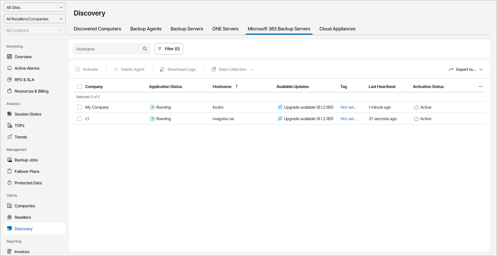

# Viewing and Exporting Veeam Backup for Microsoft 365 Server Details

You can view details on managed Veeam Backup for Microsoft 365 servers and export them to a CSV or XML file.

To view and export Veeam Backup for Microsoft 365 server details:

1. Log in to Veeam Service Provider Console.

For details, see [Accessing Veeam Service Provider Console](access_vac.md).

1. In the menu on the left, click Discovery.
2. Open the Microsoft 365 Backup Servers tab.

Veeam Service Provider Console will display a list of all managed Veeam Backup for Microsoft 365 servers.

To narrow down the list of servers, you can apply the following filters:

* Hostname — search the list of servers by server name.
* Application status — limit the list of servers by application status (Running, Not running).
* Management agent status — limit the list of servers by management agent status (Healthy, Warning, Error).
* Management agent version — limit the list of servers by management agent version (Up-to-date, Out-of-date, Patch available, N/A).

* Available updates — limit the list of servers by update status (Up-to-date, Update available, Attention required).

* Site/Reseller/Company/Location — limit the list of servers by Veeam Cloud Connect site, reseller, company and location to which servers belong. To limit the list of servers by site, reseller, company and location, use filters at the top left corner of the Veeam Service Provider Console window.

The Site filter is available only if you have connected to Veeam Service Provider Console more than one Veeam Cloud Connect server.

1. To export Veeam Backup for Microsoft 365 server details, click Export to and choose a format of the exported data:

* CSV — choose this option to structure exported data as a CSV file.
* XML — choose this option to structure exported data as an XML file.

The file with exported data will be saved to the default download location on your computer.

Each Veeam Backup for Microsoft 365 server in the list is described with a set of properties. By default, some properties in the list are hidden. To display additional properties, click the ellipsis on the right of the list header and choose properties that must be displayed.

* Company — name of a company to which a Veeam Backup for Microsoft 365 server belongs.

* Site — name of the Veeam Cloud Connect site on which the company is registered.

* Location — name of a location to which a Veeam Backup for Microsoft 365 server belongs.

* Application Status — status of the application running on a computer (Running, Not running).

You can click the Not running link, to view error details.

* Hostname — name of a computer on which Veeam Backup for Microsoft 365 server is deployed.

* Available Updates — update status of Veeam Backup for Microsoft 365 server (Up-to-date, Upgrade available, Patch available, Manual upgrade required).

* Server Version — version of a Veeam Backup for Microsoft 365 server.
* Tag — tag assigned to a Veeam Service Provider Console management agent installed on a Veeam Backup for Microsoft 365 server.
* Last Heartbeat — time period since a Veeam Service Provider Console management agent sent the latest heartbeat to Veeam Service Provider Console.
* Management Agent Status — Veeam Service Provider Console management agent status (Healthy, Warning, Error).

You can click the Error link, to view error details.

* Management Agent Version — Veeam Service Provider Console management agent version.
* IP Address — IP address of a computer on which Veeam Backup for Microsoft 365 server is deployed.
* Activation Status — activation status of a Veeam Backup for Microsoft 365 server.
* [For Portal Administrator] Description — description of a Veeam Backup for Microsoft 365 server.

