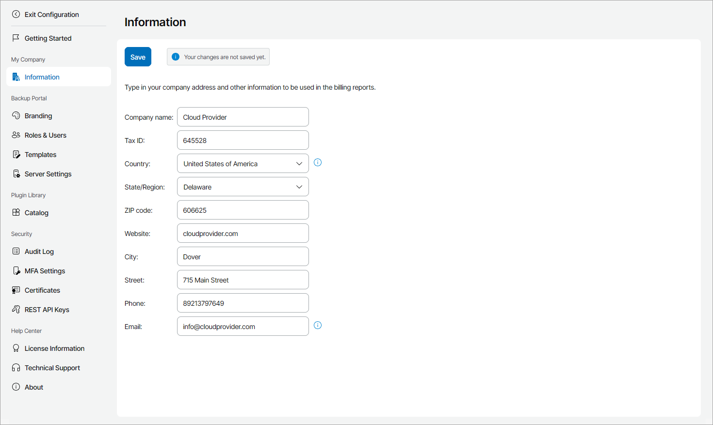

# Filling Company Profile

Before you start working with Veeam Service Provider Console, you must fill in the company profile. The profile contains information about the service provider company, such as the company name, address and so on. Company profile details are displayed in invoices, backup reports and email notifications.

Required Privileges

To perform this task, a user must have the following role assigned: Portal Administrator.

Filling Company Profile

To fill the company profile:

1. Log in to Veeam Service Provider Console.

For details, see [Accessing Veeam Service Provider Console](access_vac.md).

1. At the top right corner of the Veeam Service Provider Console window, click Configuration.
2. In the configuration menu on the left, click Information.
3. In the Company name field, specify a full name of your company.
4. In the Tax ID field, specify your tax identification number.
5. In the Country, State/Region, ZIP code, Website, City, Street and Phone fields, specify your company address and contact information.

The specified country and region will be used to display the company on the Organizations Health map on the Overview dashboard. For details, see [Overview](overview.md).

1. In the Email field, specify a contact email address.

This address will be displayed in the From field in the notifications sent by Veeam Service Provider Console. For details on notification settings, see [Configuring Notification Settings](configure_email_settings.md).

1. Click Save.

The specified company name, tax ID, phone number and address will be displayed in invoices.

