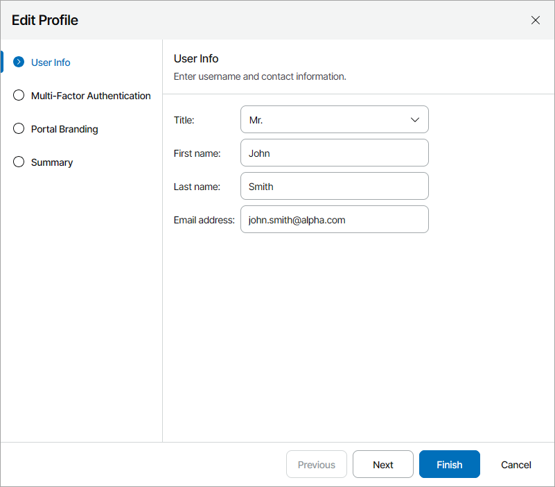
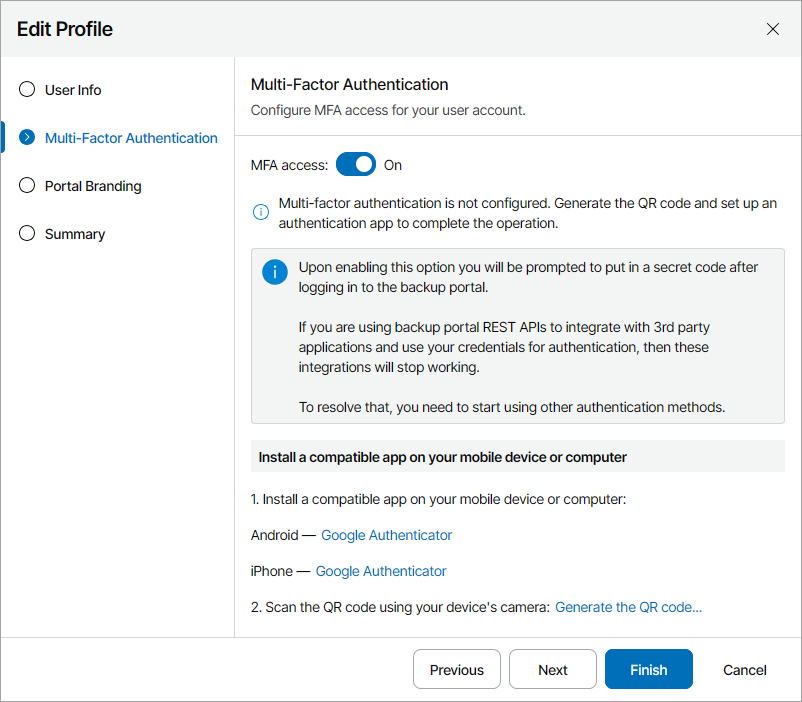
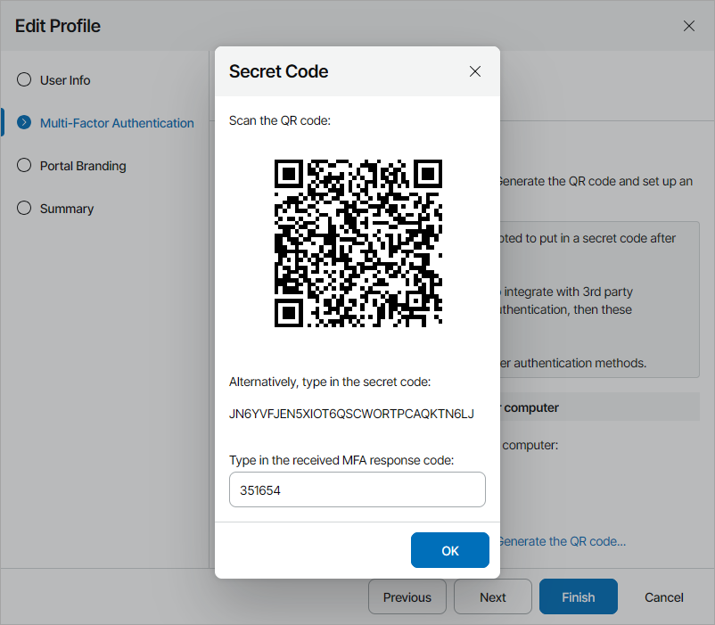
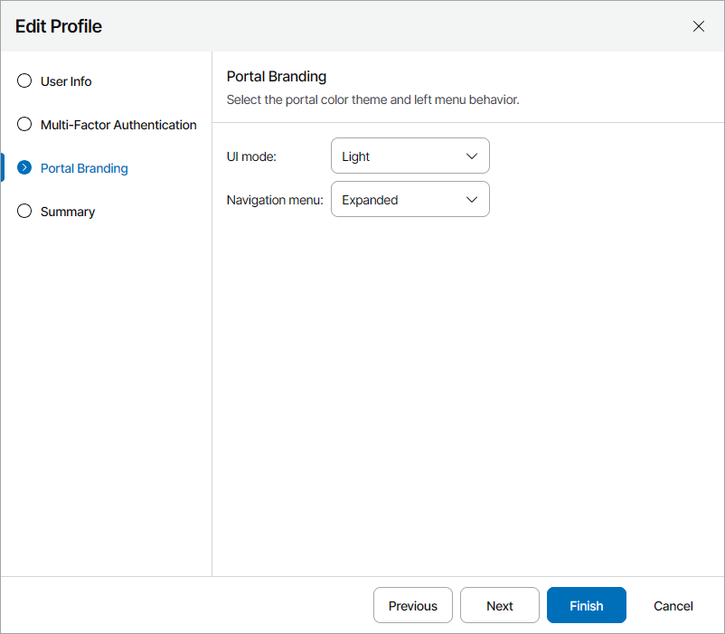
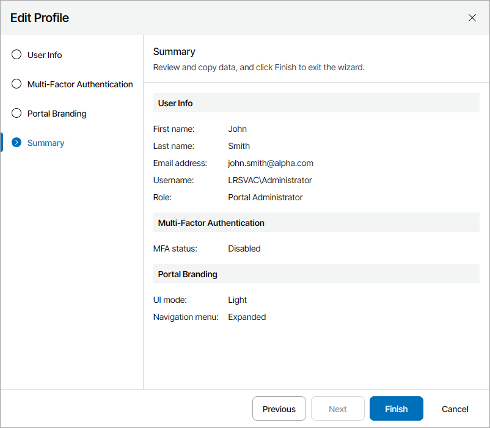

# Filling User Profile

Administrator Portal users can specify contact information, configure MFA settings, and change the portal color scheme in the user profile. You may need to fill your user profile to enable MFA for your account and receive email notifications, such as alarm notifications.

Required Privileges

To perform this task, a user must have one of the following roles assigned: Portal Administrator, Portal Operator.

Filling User Profile

To fill your user profile:

1. Log in to Veeam Service Provider Console.

For details, see [Accessing Veeam Service Provider Console](access_vac.md).

1. At the top right corner, click your user name and choose Edit Profile.

Veeam Service Provider Console will open the Edit Profile wizard.

1. At the User Info step of the wizard, add your title, first name, last name and email address.

Veeam Service Provider Console will use this email address to send email notifications intended for Administrator Portal users.

1. To enable multi-factor authentication for your user account, at the Multi-Factor Authentication step of the wizard:

1. Set the MFA access toggle to On and click the Generate the QR code link.

The Secret Code window will open.

1. In an authenticator application, scan the QR code or enter the secret code to create a new account.
2. In the Secret Code window, type in the response code generated by the authenticator application and click OK.

For details on multi-factor authentication, see [Configuring Multi-Factor Authentication](mfa.md).

If you want to disable multi-factor authentication for your user account, set the Enable the MFA access toggle to Off.

1. At the Portal Branding step of the wizard:

1. From the UI mode drop-down list, select the portal color theme (Light, Dark, System).
2. From the Navigation menu drop-down list, select the behavior of the navigation menu on the left (Expanded, Collapsed).

1. At the Summary step of the wizard, review the profile settings.

1. Click Finish.

