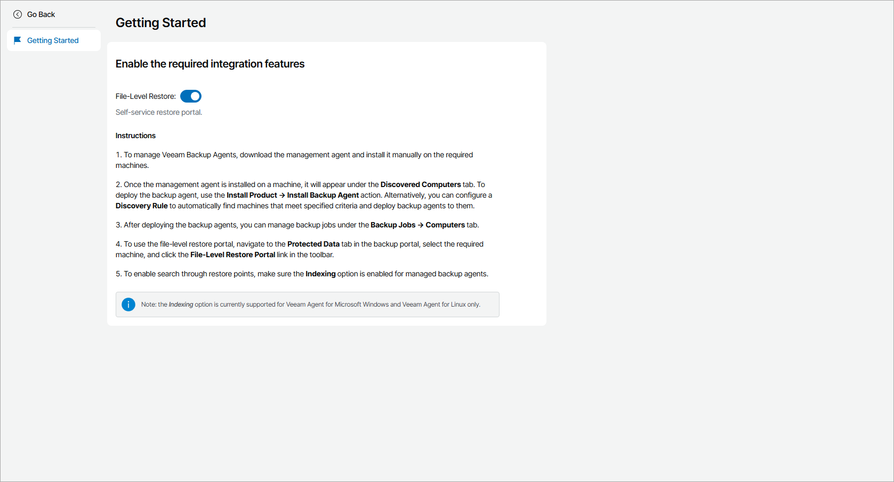

# Performing File-Level Restore

You can recover individual files and folders from backups created by Veeam backup agent jobs. You can use Veeam backup agent backups stored on a Veeam Backup & Replication repository, Veeam Cloud Connect repository, local drive or network shared folder.

In Veeam Service Provider Console, you can restore files and folders to their initial location or download restored data to your computer. When you perform a file-level restore, Veeam Service Provider Console displays the backup content in the file-level restore portal. You can browse the guest OS files and folders, restore them to original location and overwrite or keep original objects or download ZIP archive with restored objects to your computer. When you restore guest OS files and folders, Veeam Service Provider Console connects to the Veeam backup agent installed on remote computer which performs the restore process.

To access the file-level restore portal, you must enable the file-level restore functionality in Veeam Agent plugin. For details, see [Enabling File-Level Restore](#plugin).

|  |
| --- |
| Note: |
| When you close the file-level restore portal or it is closed by timeout, Veeam Service Provider Console unmounts the restore points that are not used in active restore tasks. |

Enabling File-Level Restore

To enable access to the file-level restore portal:

1. Log in to Veeam Service Provider Console as a Portal Administrator.

For details, see [Accessing Veeam Service Provider Console](access_vac.md).

1. At the top right corner of the Veeam Service Provider Console window, click Configuration.
2. In the configuration menu on the left, click Catalog.
3. Click the Veeam Agent plugin tile.
4. In the Integration Features section, set toggle next to the File-Level Restore feature to On.

|  |
| --- |
| Note: |
| File-level restore is available for Veeam Agent for Microsoft Windows version 6.0 and later, Veeam Agent for Mac version 2.0 and later, Veeam Agent for Linux version 6.0 or later. Restore from Veeam Cloud Connect and Veeam Backup & Replication repositories is available for Veeam Backup & Replication version 12.0 and later. |

In This Section

* [Restoring Windows Files](flr_win.md)
* [Restoring Linux Files](flr_linux.md)
* [Restoring Mac Files](flr_mac.md)

