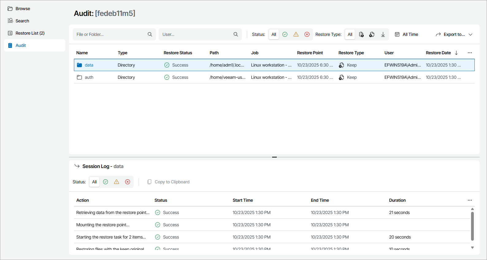

# Step 4. Review Restored Object Details

In the file-level restore portal, you can view and export restored object details and session details:

1. On the file-level restore portal, click Audit.
2. To narrow down the list of restored objects, you can use the following filters:

* Status — limit the list of objects by restore session status (Success, Warning, Failed).
* Restore Type — limit the list of objects by restore action type (Overwrite, Keep, Download).
* File or Folder — limit the list of objects by the name of restored object.
* User — limit the list of objects by the user name of restore initiator.
* Time Period — limit the list of objects by date when restore session finished.

1. To view restore session details, click the necessary object in the list.

Veeam Service Provider Console will display session details in the Session Log section. For details, see [Restore Session Details](#session).

1. To export restored objects details, click Export to and choose a format of the exported data:

* CSV — choose this option to structure exported data as a CSV file.
* XML — choose this option to structure exported data as an XML file.

The file with exported data will be saved to the default download location on your computer.

Each restored object in the list is described with the following properties:

* Name — restored object name.
* Type — restored object type.
* Restore Status — restore session status (Success, Warning, Failed).
* Path — restored object path.
* Size — restored object size.
* Job — name of a backup job.
* Restore Point — date and time when the restore point was created.
* Restore Type — restore action type (Overwrite, Keep, Download).
* User — name of a user who performed restore.
* Restore Date — date and time when the restore session finished.

Restore Session Details

Each restore action in the session log is described with the following properties:

* Action — restore action message.
* Status — restore action status (Success, Warning, Failed).
* Start Time — date and time when the restore action started.
* End Time — date and time when the restore action finished.
* Duration — duration of the restore session action.

